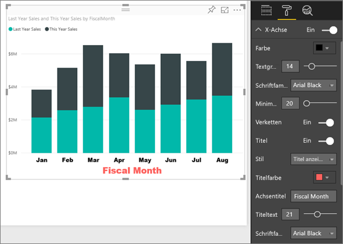
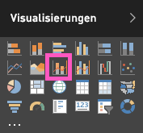
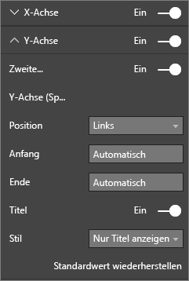

# Anpassen der Eigenschaften der X- und Y-Achse

In diesem Tutorial lernen Sie verschiedene Möglichkeiten zum Anpassen der X- und Y-Achse in Ihren visuellen Elementen kennen. Nicht alle visuellen Elemente verfügen über Achsen. Kreisdiagramme haben z.B. keine Achsen. Außerdem variieren die Anpassungsoptionen visueller Elemente. Die vielen Optionen können nicht in einem einzigen Artikel behandelt werden, darum betrachten wir die gängigsten Achsenanpassungen, damit Sie sich mit dem visuellen Bereich **Format** in der Berichtscanvas von Power BI vertraut machen können.  

> [!NOTE]
> Diese Seite gilt für sowohl den Power BI-Dienst als auch für Power BI Desktop. Diese Anpassungsmöglichkeiten, die verfügbar sind, wenn das **Format**-Symbol (das Farbrollensymbol ) ausgewählt ist, sind auch in Power BI Desktop verfügbar.

Sehen Sie, wie Amanda ihre X- und Y-Achse anpasst. Sie zeigt die verschiedenen Möglichkeiten, bei Verwendung von Drilldown und Drillup die Verkettung zu steuern.

<iframe width="560" height="315" src="https://www.youtube.com/embed/9DeAKM4SNJM" frameborder="0" allowfullscreen></iframe>

## Voraussetzungen

- Der Power BI-Dienst

- Bericht zum Analysebeispiel für den Einzelhandel

## Anpassen der Visualisierung von X- und Y-Achse in Berichten

Melden Sie sich beim [Power BI-Dienst](https://app.powerbi.com) an, und öffnen Sie den Bericht zum [Analysebeispiel für den Einzelhandel](../sample-datasets.md) in der [Bearbeitungsansicht](../service-interact-with-a-report-in-editing-view.md).

### Erstellen einer Visualisierung eines gestapelten Säulendiagramms

Bevor Sie die Visualisierung anpassen können, müssen Sie sie erstellen.

1. Erweitern Sie im Power BI-Dienst **Mein Arbeitsbereich**.

1. Scrollen Sie nach unten, und wählen Sie **Analysebeispiel für den Einzelhandel** aus der Liste der **Datasets** aus.

1. Wählen Sie im Bereich **Visualisierungen** das Symbol für das gestapelte Säulendiagramm aus.

    

1. Um die Werte der X-Achse einzustellen, wählen Sie im Bereich **Felder** die Option **Zeit** > **FiscalMonth** aus.

1. Um die Werte der Y-Achse einzustellen, wählen Sie im Bereich **Felder** **Verkäufe** > **Verkäufe im letzten Jahr** und **Verkäufe** > **Verkäufe in diesem Jahr** > **Wert** aus.

    

### Anpassen der X-Achse

Jetzt können Sie Ihre X-Achse anpassen.

1. Wählen Sie im Bereich **Visualisierungen** die Option **Format** (das Farbrollensymbol ) aus, um die Anpassungsoptionen anzuzeigen.

1. Erweitern Sie die Optionen für die X-Achse.

   

1. Setzen Sie den **X-Achse**-Schieberegler auf **Ein**.

    

    Das Deaktivieren der X-Achse empfiehlt sich u.a., um mehr Platz für weitere Daten zu schaffen.

1. Formatieren Sie Textfarbe, Textgröße und Schriftart:

    - **Farbe**: Wählen Sie Schwarz aus.

    - **Textgröße**: Geben Sie *14* ein.

    - **Schriftfamilie**: Wählen Sie **Arial Black** aus.

1. Schieben Sie die Option **Titel** auf **Ein**, um den Namen der X-Achse anzuzeigen. In diesem Fall ist es **FiscalMonth**.

1. Formatieren Sie die Textfarbe, die Textgröße und die Schriftart des Titels:

    - **Titelfarbe**: Wählen Sie Orange aus.

    - **Achsentitel**: Geben Sie *Fiscal Month* ein.

    - **Größe des Titeltexts**: Geben Sie *21* ein.

Nachdem Sie die Anpassungen abgeschlossen haben, wird Ihr gestapeltes Säulendiagramm in etwa so aussehen:

Speichern Sie die Änderungen, die Sie vorgenommen haben, und fahren Sie mit dem nächsten Abschnitt fort.

Wenn Sie einmal alle Änderungen zurücksetzen müssen, wählen Sie **Standardwert wiederherstellen** am unteren Rand des Anpassungsbereichs der **X-Achse** aus.

### Anpassen der Y-Achse

Als Nächstes passen Sie Ihre Y-Achse an.

1. Erweitern Sie die Optionen für die Y-Achse.

   

1. Setzen Sie den **Y-Achse**-Schieberegler auf **Ein**.  

    

    Das Deaktivieren der Y-Achse empfiehlt sich u.a., um mehr Platz für weitere Daten zu schaffen.

1. Legen Sie als **Position** der Y-Achse **Rechts** fest.

1. Formatieren Sie Textfarbe, Textgröße und Schriftart:

    - **Farbe**: Wählen Sie Schwarz aus.

    - **Textgröße**: Geben Sie *14* ein.

    - **Schriftfamilie**: Wählen Sie **Arial Black** aus.

1. Legen Sie für **Anzeigeeinheiten** **Millionen** und für **Dezimalstellen für Werte** *0* fest.

1. Da dieses Visual durch eine Y-Achse nicht verbessert wird, lassen Sie **Titel** auf **Aus**.  

1. Wir heben die Gitternetzlinien durch Ändern der Farbe und Erhöhen der Strichstärke hervor:

    - **Farbe**: Wählen Sie Dunkelgrau aus.

    - **Strichstärke**: Geben Sie *2* ein.

Nach diesen Anpassungen sollte Ihr Säulendiagramm etwa so aussehen:

## Anpassen von Visualisierungen mit zwei Y-Achsen

Zunächst erstellen Sie ein Kombinationsdiagramm, das die Auswirkungen der Ladenanzahl auf die Verkäufe prüft. Dies ist das gleiche Diagramm, das auch im [Tutorial zu Kombinationsdiagrammen](power-bi-visualization-combo-chart.md) erstellt wird. Danach formatieren Sie die beiden Y-Achsen.

### Erstellen eines Diagramms mit zwei Y-Achsen

1. Erstellen Sie ein neues Liniendiagramm, das **Verkäufe > Bruttogewinn % Vorjahr** nach **Zeit > Geschäftsmonat** nachverfolgt.

    

    > [!NOTE]
    > Hilfe zum Sortieren nach Monat finden Sie unter [Sortieren mithilfe anderer Kriterien](../consumer/end-user-change-sort.md#other).

    Im Januar betrug der Prozentsatz des Bruttogewinns 35%, erreichte im April mit 45% einen Höchststand, sank im Juli und erreichte im August wieder einen Höchststand. Sehen wir ein ähnliches Muster bei den Umsätzen im letzten und in diesem Jahr?

1. Fügen Sie dem Liniendiagramm **Verkäufe in diesem Jahr > Wert** und **Verkäufe im letzten Jahr** hinzu.

    

    Da der **Bruttogewinn Vorjahr %** (die blaue Linie entlang der Gitternetzlinie für **0M%** ) wesentlich kleiner ist als die **Umsätze**, können diese Werte nur schwer verglichen werden. Und die Prozentwerte in den Bezeichnungen auf der Y-Achse sind viel zu groß.

1. Konvertieren Sie das Liniendiagramm zu einem Linien- und gestapelten Säulendiagramm, damit die Visualisierung besser gelesen und interpretiert werden kann.

   

1. Ziehen Sie **Bruttogewinn % Vorjahr** aus **Spaltenwerte** in **Zeilenwerte**.

    

    Jetzt wird das im ersten Abschnitt erstellte gestapelte Säulendiagramm mit einem Liniendiagramm überlagert. Optional können Sie die Schriftfarbe und -größe der Achsen formatieren, indem Sie anwenden, was Sie weiter oben gelernt haben.

   

   Power BI erstellt zwei Y-Achsen und ermöglicht die unterschiedliche Skalierung der Datasets. Die linke Achse misst die Umsätze in US-Dollar und die rechte die Prozentzahlen.

### Formatieren der sekundären Y-Achse

1. Wählen Sie im Bereich **Visualisierungen** das Farbrollensymbol aus, um die Formatoptionen anzuzeigen.

1. Erweitern Sie die Optionen für die Y-Achse.

1. Scrollen Sie nach unten, bis Sie die Option **Sekundäre anzeigen** finden. Überprüfen Sie, ob sie auf **Ein** gesetzt ist.

   

1. (Optional) Passen Sie die beiden Achsen an. Wenn Sie die **Position** für die Spaltenachse oder Zeilenachse wechseln, werden die Seiten der beiden Achsen vertauscht.

### Hinzufügen von Titeln zu beiden Achsen

Bei einer so komplexen Visualisierung ist es hilfreich, wenn den Achsen Titel hinzugefügt werden.  Mithilfe von Titeln können Ihre Kollegen erfahren, was mit der Visualisierung angegeben werden soll.

1. Legen Sie **Titel** für **Y-Achse (Spalte)** und **Y-Achse (Linie)** auf **Ein** fest.

1. Legen Sie für **Stil** für beide die Option **Nur Titel anzeigen** fest.

   

1. Das Kombinationsdiagramm zeigt nun zwei Achsen mit Titeln an.

   

Weitere Informationen finden Sie unter [Tipps und Tricks zur Farbformatierung in Power BI](service-tips-and-tricks-for-color-formatting.md).

## Zu beachtende Aspekte und Problembehandlung

Wenn vom Besitzer des Berichts die X-Achse als Datentyp kategorisiert wurde, wird die Option **Typ** angezeigt, und Sie können zwischen „Fortlaufend“ und „Kategorie“ wählen.

## Nächste Schritte

- [Visualisierungen in Power BI-Berichten](power-bi-report-visualizations.md)

- [Anpassen der Titel, Legenden und Hintergründe von Visualisierungen](power-bi-visualization-customize-title-background-and-legend.md)

- [Erste Schritte mit Farbeinstellungen und Achseneigenschaften](service-getting-started-with-color-formatting-and-axis-properties.md)

- [Grundkonzepte für Benutzer des Power BI-Diensts](../consumer/end-user-basic-concepts.md)

Weitere Fragen? [Wenden Sie sich an die Power BI-Community](http://community.powerbi.com/)
