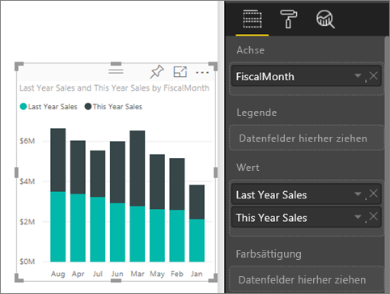
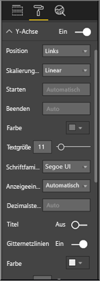
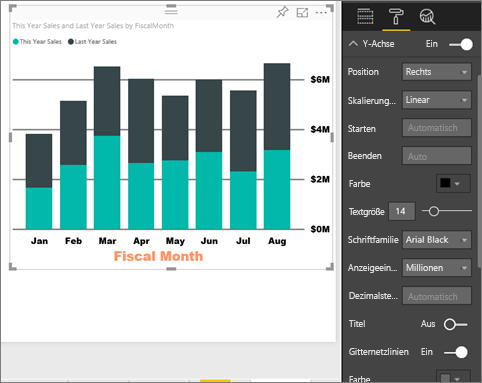

# Anpassen der Eigenschaften der X- und Y-Achse
In diesem Tutorial lernen Sie verschiedene Möglichkeiten zum Anpassen der X- und Y-Achse in Ihren visuellen Elementen kennen. Nicht alle visuellen Elemente verfügen über Achsen oder können angepasst werden. Bei Kreisdiagrammen gibt es z. B. keine Achsen. Darüber hinaus variieren die Anpassungsoptionen für die verschiedenen visuellen Elemente, sodass nicht alle Optionen in einem einzigen Artikel abgedeckt werden können. Betrachten wir daher die gängigsten Achsenanpassungen, damit Sie sich mit der Registerkarte für die visuelle Formatierung im Berichtszeichenbereich von Power BI vertraut machen können.  

> [!NOTE]
> Diese Seite gilt für sowohl den Power BI-Dienst als auch für Power BI Desktop. Diese Anpassungsmöglichkeiten sind auch in Power BI Desktop verfügbar, wenn **Format** (das Farbrollersymbol ) ausgewählt ist.  
>
>

Sehen Sie sich an, wie Amanda ihre X- und Y-Achse anpasst und die verschiedenen Möglichkeiten zum Steuern der Verkettung bei Verwenden der Drillup- und Drilldownfunktionen veranschaulicht. Befolgen Sie dann die detaillierten Anweisungen unter dem Video, um es selbst mit dem Analysebeispiel für den Einzelhandel auszuprobieren.

<iframe width="560" height="315" src="https://www.youtube.com/embed/9DeAKM4SNJM" frameborder="0" allowfullscreen></iframe>

## Anpassen der Visualisierung von X-Achsen in Berichten
## Erstellen einer Visualisierung eines gestapelten Diagramms
Melden Sie sich beim Power BI-Dienst an, und öffnen Sie den Bericht des **Analysebeispiels für den Einzelhandel** in der [Bearbeitungsansicht](../service-interact-with-a-report-in-editing-view.md). Laden Sie hierfür das [Analysebeispiel für den Einzelhandel](../sample-datasets.md) herunter.

1. Erstellen Sie ein Säulendiagramm, das den Wert für den Absatz des laufenden Jahres und den des Vorjahres nach Geschäftsmonat anzeigt.
2. Konvertieren Sie es in ein gestapeltes Säulendiagramm.

    

## Anpassen der X-Achse
1. Wählen Sie im Bereich für Visualisierungen und Filter die Option **Format** (das Farbrollersymbol ) aus, um die Anpassungsoptionen anzuzeigen.
2. Erweitern Sie die Optionen für die X-Achse.

   
3. Mithilfe des Schiebereglers für „Ein“ und „Aus“ aktivieren bzw. deaktivieren Sie die X-Achse. Belassen Sie die Einstellung vorerst bei **Ein**.  Das Deaktivieren der X-Achse empfiehlt sich u.a., um mehr Platz für weitere Daten zu schaffen.

    
4. Formatieren Sie die Textfarbe, die Textgröße und die Schriftart. In diesem Beispiel haben wir die **Farbe** für den Text auf Schwarz, die **Textgröße** auf 14 und die **Schriftart** auf Arial Black festgelegt.  
5. Wählen Sie für den Titel der X-Achse die Einstellung **Ein** aus, und zeigen Sie die Bezeichnung der X-Achse an – in diesem Fall **Geschäftsmonat**.  
6. Formatieren Sie die Textfarbe, die Textgröße und die Schriftart des Titels.  In diesem Beispiel wurde **Farbe des Titels** auf Orange festgelegt, **Achsentitel** wurde in **Geschäftsmonat** geändert, und **Größe des Titeltexts** wurde auf 21 festgelegt.
7. Wählen Sie zum Sortieren nach Geschäftsmonat die Auslassungspunkte (...) in der rechten oberen Ecke des Diagramms aus, und wählen Sie **Nach Geschäftsmonat sortieren**.

    Nach diesen Anpassungen sollte Ihr Säulendiagramm etwa so aussehen:

     

Wenn Sie die Anpassungen der X-Achse zurücksetzen möchten, wählen Sie **Standardwert wiederherstellen** am unteren Rand des Anpassungsbereichs der **X-Achse** aus.

## Anpassen der Y-Achse
1. Erweitern Sie die Optionen für die Y-Achse.

   

2. Mithilfe des Schiebereglers für „Ein“ und „Aus“ aktivieren bzw. deaktivieren Sie die Y-Achse. Belassen Sie die Einstellung vorerst bei **Ein**.  Das Deaktivieren der Y-Achse empfiehlt sich u.a., um mehr Platz für weitere Daten zu schaffen.
   
    
3. Verschieben Sie die **Position** der Y-Achse nach rechts.
4. Formatieren Sie die Textfarbe, die Textgröße und die Schriftart. In diesem Beispiel haben wir die **Farbe** für den Text auf Schwarz, die **Textgröße** auf 14 und die **Schriftart** auf Arial Black festgelegt.  
5. Lassen Sie **Anzeigeeinheiten** auf „Millionen“ und **Dezimalstellen für Werte** auf 0 (null) festgelegt.
6. Da diese Visualisierung durch eine Y-Achse nicht verbessert wird, lassen Sie **Titel** deaktiviert.  
7. Wir heben die Gitternetzlinien hervor, indem wir die **Farbe** in Dunkelgrau ändern und die **Strichstärke** auf 2 erhöhen.

    Nach diesen Anpassungen sollte Ihr Säulendiagramm etwa so aussehen:

     

## Anpassen von Visualisierungen mit zwei Y-Achsen
Zunächst erstellen Sie ein Kombinationsdiagramm, das die Auswirkungen der Ladenanzahl auf die Verkäufe prüft.  Dies ist das gleiche Diagramm, das auch im [Tutorial zu Kombinationsdiagrammen](power-bi-visualization-combo-chart.md) erstellt wird. Danach formatieren Sie die beiden Y-Achsen.

### Erstellen eines Diagramms mit zwei Y-Achsen
1. Erstellen Sie ein neues Liniendiagramm, das **Verkäufe > Bruttogewinn % Vorjahr** nach **Zeit > Geschäftsmonat** nachverfolgt.
2. Sortieren Sie die visuellen Elemente nach Monat, indem Sie auf die Auslassungspunkte (...) klicken und **Sortieren nach Monat** auswählen.

    

    > [NOTE]: For help sorting by month, see [sorting by other criteria](../consumer/end-user-change-sort.md#other)

    Im Januar lag der Prozentsatz des Bruttogewinns bei 35 %, der Höchststand im April lag bei 45 %, im Juli fiel der Wert, und im August erreichte er wieder einen Spitzenwert. Sehen wir ein ähnliches Muster bei den Umsätzen im letzten und in diesem Jahr?
     
3. Fügen Sie dem Liniendiagramm **Verkäufe in diesem Jahr > Wert** und **Verkäufe im letzten Jahr** hinzu. Da der **Bruttogewinn % Vorjahr** (die blaue Linie entlang der Gitternetzlinie für 0 %) wesentlich kleiner ist als die **Umsätze**, können diese Werte nur schwer verglichen werden. Und die Prozentwerte in den Bezeichnungen auf der Y-Achse sind viel zu groß.      

    

5. Konvertieren Sie das Liniendiagramm zu einem Linien- und gestapelten Säulendiagramm, damit die Visualisierung besser gelesen und interpretiert werden kann.

   

6. Ziehen Sie **Bruttogewinn % Vorjahr** aus **Spaltenwerte** in **Zeilenwerte**. Wir verfügen jetzt über das gestapelte Säulendiagramm, das wir oben erstellt haben, ***und*** ein Liniendiagramm.  (Optional können Sie die Schriftfarbe und -größe der Achsen formatieren, indem Sie anwenden, was Sie weiter oben gelernt haben.)
   
   Power BI erstellt zwei Achsen, sodass die Datasets anders skaliert werden können. Die linke Achse gibt den Dollarbetrag an, die rechte Achse die Prozentzahl.

   

### Formatieren der sekundären Y-Achse
1. Wählen Sie im Bereich **Visualisierungen** das Farbrollersymbol aus, um die Formatierungsoptionen anzuzeigen.    
2. Erweitern Sie die Optionen für die Y-Achse, indem Sie den Pfeil nach unten auswählen.    
3. Scrollen Sie in der Liste zu den Optionen für **Sekundäre anzeigen**. Legen Sie **Sekundäre anzeigen** von **Aus** auf **Ein** fest.    

   

   

4. (Optional) Passen Sie die beiden Achsen an. Wenn Sie die **Position** für die Spaltenachse oder Zeilenachse wechseln, werden die Seiten der beiden Achsen vertauscht.

   

### Hinzufügen von Titeln zu beiden Achsen
Bei einer so komplexen Visualisierung ist es hilfreich, wenn den Achsen Titel hinzugefügt werden.  Mithilfe von Titeln können Ihre Kollegen nachvollziehen, was mit der Visualisierung angegeben werden soll.

1. Legen Sie **Titel** für **Y-Achse (Spalte)** und **Y-Achse (Linie)** auf **Ein** fest.
2. Wählen Sie für **Stil** die Option **Nur Titel anzeigen**.

       
3. Das Kombinationsdiagramm zeigt nun zwei Achsen mit Titeln an.

   

Weitere Informationen finden Sie unter [Tipps und Tricks zu Farbformatierung, Beschriftung und Achseneigenschaften](service-tips-and-tricks-for-color-formatting.md).

## Zu beachtende Aspekte und Problembehandlung
Wenn vom Besitzer des Berichts die X-Achse als Datentyp kategorisiert wurde, wird die Option **Typ** angezeigt, und Sie können zwischen „Fortlaufend“ und „Kategorie“ wählen.

## Nächste Schritte
Weitere Informationen zu [Visualisierungen in Power BI-Berichten](power-bi-report-visualizations.md)

[Anpassen von T](power-bi-visualization-customize-title-background-and-legend.md)[iteln, Hintergründen und Legenden](power-bi-visualization-customize-title-background-and-legend.md)

[Anpassen von Farben und Achseneigenschaften](service-getting-started-with-color-formatting-and-axis-properties.md)

[Power BI – Grundkonzepte](../consumer/end-user-basic-concepts.md)

Weitere Fragen? [Wenden Sie sich an die Power BI-Community](http://community.powerbi.com/)
