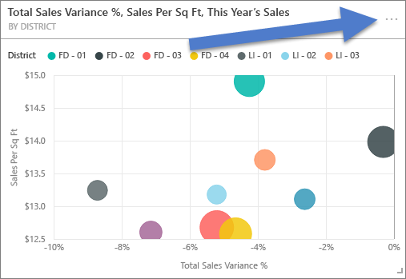
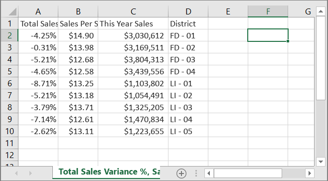
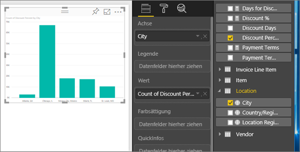
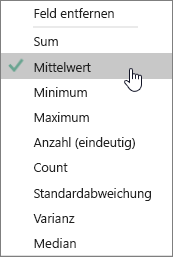
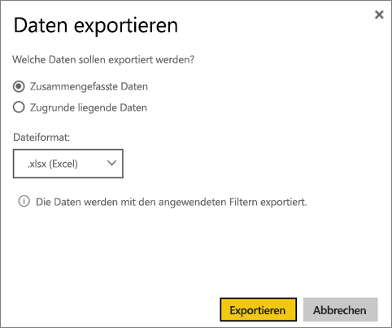
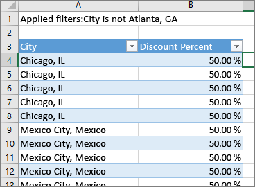
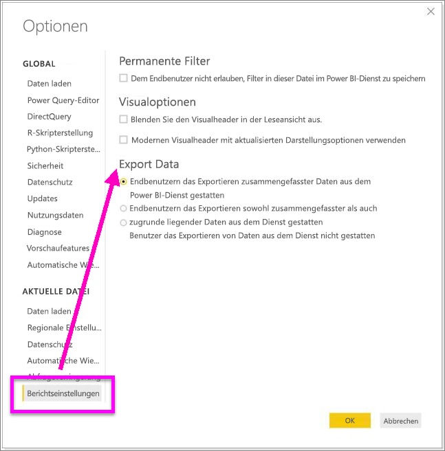

# Exportieren von Daten aus Visualisierungen
Wenn Sie die Daten anzeigen möchten, mit denen eine Visualisierung erstellt wird, können Sie die [Daten in Power BI anzeigen](service-reports-show-data.md) oder als XLSX- bzw. CSV-Datei in Excel exportieren. Für das Exportieren von Daten sind eine Pro- oder Premium-Lizenz und Bearbeitungsberechtigungen für das Dataset und den Bericht erforderlich. 

Sehen Sie zu, wie Will Daten aus einer der Visualisierungen in seinem Bericht exportiert, als XLSX-Datei speichert und dann in Excel öffnet. Befolgen Sie dann die schrittweisen Anleitungen unter dem Video, um es selbst ausprobieren.

<iframe width="560" height="315" src="https://www.youtube.com/embed/KjheMTGjDXw" frameborder="0" allowfullscreen></iframe>

## Aus einer Visualisierung in einem Power BI-Dashboard
1. Wählen Sie die Auslassungszeichen in der rechten oberen Ecke der Visualisierung aus.

    
2. Wählen Sie das Symbol **Daten exportieren** aus.

    
3. Die Daten werden in eine CSV-Datei exportiert. Wenn die Visualisierung gefiltert wird, werden auch die heruntergeladenen Daten gefiltert.    
4. Sie werden im Browser zum Speichern der Datei aufgefordert.  Öffnen Sie die CSV-Datei nach dem Speichern in Excel.

    

## Aus einer Visualisierung in einem Bericht
Öffnen Sie den [Bericht „Procurement analysis sample“ (Analysebeispiel für Beschaffung)](../sample-procurement.md) in der Bearbeitungsansicht, um dem Tutorial zu folgen. Fügen Sie eine neue leere Berichtsseite hinzu. Befolgen Sie anschließend die untenstehenden Schritte, um eine Aggregation und einen Filter auf Visualisierungsebene hinzuzufügen.

1. Erstellen Sie ein Säulendiagramm.  Wählen Sie im Bereich „Felder“ **Location > City** (Ort > Stadt) und **Invoice > Discount Percent** (Rechnung > Rabatt in Prozent) aus.  Sie müssen den **Rabatt in Prozent** möglicherweise in den Wertebereich verschieben. 

    
2. Ändern Sie die Aggregation für **Discount Percent** (Rabatt in Prozent) von **Count** (Anzahl) in **Average** (Durchschnitt). Klicken Sie im Wertebereich auf den Pfeil rechts neben **Discount Percent** (Rabatt in Prozent), wobei die Bezeichnung auch **Count of Discount Percent** (Anzahl von Rabatt in Prozent) lauten kann, und wählen Sie **Average** (Durchschnitt) aus.

    
3. Fügen Sie **City** (Stadt) einen Filter hinzu, um **Atlanta** zu entfernen.

   

   Nun können Sie beide Optionen für das Exportieren von Daten ausprobieren. 

4. Wählen Sie die Auslassungszeichen in der rechten oberen Ecke der Visualisierung aus. Wählen Sie  **Daten exportieren**aus.

   
5. Wenn Ihre Visualisierung in Power BI Online ein Aggregat aufweist (wenn Sie beispielsweise **Anzahl** in *Durchschnitt*, *Summe* oder *Minimum* geändert haben), sind zwei Optionen verfügbar: **Zusammengefasste Daten** und **Zugrunde liegende Daten**. In Power BI Desktop haben Sie nur die Option für **Zusammengefasste Daten**. Weitere Informationen zu Aggregaten finden Sie unter [Aggregate in Power BI](../service-aggregates.md).
    
6. Wählen Sie **Zusammengefasste Daten** > **Exportieren** aus, und wählen Sie das Format „.xlsx“ oder „.csv“ aus. Die Daten werden aus Power BI exportiert.  Wenn Sie Filter auf die Visualisierung angewendet haben, werden die Daten entsprechend den Filtereinstellungen exportiert. Wenn Sie **Exportieren** auswählen, werden Sie in Ihrem Browser zum Speichern aufgefordert. Öffnen Sie die Datei nach dem Speichern in Excel.

   **Zusammengefasste Daten:** Wählen Sie diese Option aus, wenn Sie die im Visual angezeigten Daten exportieren möchten.  Diese Exportart zeigt nur die Daten (Spalten und Measures) an, die Sie zum Erstellen des Visuals ausgewählt haben.  Wenn das Visual über ein Aggregat verfügt, exportieren Sie aggregierte Daten. Wenn Sie beispielsweise über ein Balkendiagramm mit vier Balken verfügen, erhalten Sie vier Datenzeilen. Zusammengefasste Daten sind im XLSX- und CSV-Format verfügbar.

   In diesem Beispiel wird im Excel-Export eine Summe für jede Stadt angezeigt. Da Atlanta herausgefiltert wurde, ist die Stadt nicht in den Ergebnissen enthalten.  In der ersten Zeile der Tabelle sind die Filter aufgeführt, die beim Extrahieren der Daten aus Power BI angewendet wurden.

   
7. Wählen Sie nun **Zugrunde liegende Daten** > **Exportieren** aus, und wählen Sie das Format „.xlsx“ aus. Die Daten werden aus Power BI exportiert. Wenn Sie Filter auf die Visualisierung angewendet haben, werden die Daten entsprechend den Filtereinstellungen exportiert. Wenn Sie **Exportieren** auswählen, werden Sie in Ihrem Browser zum Speichern aufgefordert. Öffnen Sie die Datei nach dem Speichern in Excel.

   >[!WARNING]
   >Wenn die zugrunde liegenden Daten exportiert werden, sind alle detaillierten Daten – jede Spalte in den Daten – für die Benutzer sichtbar. Power BI-Dienst-Administratoren können dies für ihre Organisation deaktivieren. Wenn Sie Datasetbesitzer sind, können Sie proprietäre Spalten auf „Ausgeblendet“ festlegen, sodass diese weder in Desktop noch im Power BI-Dienst in der Feldliste angezeigt werden.

   **Zugrunde liegende Daten:** Wählen Sie diese Option, wenn Sie die Daten im Visual ***und*** zusätzliche Daten aus dem Modell anzeigen möchten. Im unten stehenden Diagramm erhalten Sie weitere Informationen.  Wenn Ihre Visualisierung über ein Aggregat verfügt, wird dieses durch *Zugrunde liegende Daten* entfernt. Wenn Sie **Exportieren** auswählen, werden die Daten in eine XLSX-Datei exportiert, und Sie werden im Browser dazu aufgefordert, die Datei zu speichern. Öffnen Sie die Datei nach dem Speichern in Excel.

   In diesem Beispiel enthält der Excel-Export eine Zeile für jede einzelne Zeile „City“ (Stadt) im Dataset sowie den Rabatt in Prozent für den jeweiligen Eintrag. Das heißt, die Daten werden vereinfacht und nicht aggregiert. In der ersten Zeile der Tabelle sind die Filter aufgeführt, die beim Extrahieren der Daten aus Power BI angewendet wurden.  

   

## Details zum Exportieren zugrunde liegender Daten
Die Anzeige beim Auswählen von **Zugrunde liegende Daten** variiert. Ihr Administrator oder Ihre IT-Abteilung kann Sie beim Verstehen der Details unterstützen. In Power BI Desktop oder im Power BI-Dienst wird in der Berichtsansicht ein *Measure* in der Felderliste mit einem Taschenrechnersymbol  angezeigt. Measures werden in Power BI Desktop und nicht im Power BI-Dienst erstellt.

| Visual enthält |                                                                              Was beim Export angezeigt wird                                                                              |
|-----------------|-------------------------------------------------------------------------------------------------------------------------------------------------------------------------------------|
|   Aggregate    |                                                 das *erste* Aggregat und nicht ausgeblendete Daten der gesamten Tabelle für dieses Aggregat                                                  |
|   Aggregate    | verknüpfte Daten, wenn das Visual Daten aus anderen Datentabellen verwendet, die mit der Datentabelle *\*\*verknüpft*\* sind, die das Aggregat enthält (wenn die Beziehung \*:1 oder 1:1 ist) |
|    Measures     |                                      Alle Measures im Visual *und* alle Measures aus einer beliebigen Datentabelle, die ein Measure, das in diesem Visual verwendet wird, enthält                                      |
|    Measures     |                                       Alle nicht ausgeblendeten Daten aus Tabellen, die dieses Measure enthalten (wenn die Beziehung \*:1 oder 1:1 ist)                                       |
|    Measures     |                                      Alle Daten aus allen Tabellen, die mit mindestens einer Tabelle, die die Measures enthalten, verknüpft sind (über eine Kette von \*:1 von 1:1)                                      |
|  Nur Measures  |                                                   Alle nicht ausgeblendeten Spalten aus allen verknüpften Tabellen (um das Measure zu erweitern)                                                   |
|  Nur Measures  |                                                             Zusammengefasste Daten für alle doppelten Zeilen für Modellmeasures                                                              |

### Festlegen der Exportoptionen
Power BI-Bericht-Designer kontrollieren die Typen der Datenexportoptionen, die für ihre Benutzer verfügbar sind. Die Optionen sind:
- Zulassen des Exports von zusammengefassten Daten (dies ist die Standardeinstellung für neue Berichte) 
- Zulassen des Exports von zusammengefassten und zugrunde liegenden Daten (dies war die Standardeinstellung vor Oktober 2018) 
- Export jeglicher Daten nicht zulassen  

    > [!IMPORTANT]
    > Es wird empfohlen, dass die Designer von Berichten ältere Berichte erneut überprüfen und die Exportoption bei Bedarf manuell zurücksetzen.

1. Um diese Optionen festzulegen, beginnen Sie in Power BI Desktop.

2. Wählen Sie in der oberen linken Ecke **Datei** > **Optionen und Einstellungen** > **Optionen** aus. 

3. Wählen Sie unter **Aktuelle Datei** die Option **Berichtseinstellungen** aus.

    

4. Treffen Sie Ihre Auswahl aus dem Dropdown **Daten exportieren**.

Sie können diese Einstellung auch im Power BI-Dienst aktualisieren.  

Es ist wichtig, zu beachten, dass, wenn die Einstellungen im Power BI-Administratorportal mit den Berichtseinstellungen für den Export von Daten in Konflikt stehen, die Administratoreinstellungen die Datenexporteinstellungen außer Kraft setzen. 

## Einschränkungen und Überlegungen
* Die maximale Anzahl von Zeilen, die aus **Power BI Desktop** und aus dem **Power BI-Dienst** in das CSV-Format exportiert werden kann, ist 30.000.
* Die maximale Anzahl von Zeilen, die nach XLSX exportiert werden kann, ist 150.000.
* Das Exportieren mithilfe von *Zugrunde liegende Daten* ist nicht möglich, wenn die Datenquelle eine Analysis Services-Liveverbindung ist, die Version älter als 2016 ist und die Tabellen im Modell keinen eindeutigen Schlüssel aufweisen.  
* Das Exportieren mithilfe von *Zugrunde liegende Daten* ist nicht möglich, wenn für die zu exportierende Visualisierung die Option *Elemente ohne Daten anzeigen* aktiviert ist.
* Wenn Sie DirectQuery verwenden, können maximal 16 MB Daten exportiert werden. Dies kann dazu führen, dass weniger als die maximale Anzahl von Zeilen exportiert wird, insbesondere wenn viele Spalten vorhanden sind, die Daten schwierig zu komprimieren sind und weitere Faktoren die Dateigröße erhöhen und die Anzahl exportierter Zeilen verringern.
* Wenn das Visual Daten aus mehr als einer Datentabelle verwendet und keine Beziehung zwischen diesen Tabellen im Datenmodell besteht, werden nur Daten der ersten Tabelle exportiert. 
* Benutzerdefinierte Visuals und R-Visuals werden derzeit nicht unterstützt.
* Die Funktion zum Exportieren von Daten steht Benutzern, die der Organisation nicht angehören und ein für sie freigegebenes Dashboard verwenden, nicht zur Verfügung. 
* Ein Feld (eine Spalte) kann in Power BI umbenannt werden, indem Sie doppelt auf das Feld klicken und einen neuen Namen eingeben.  Dieser neue Name wird als *Alias* bezeichnet. Es ist möglich, dass im Power BI-Bericht doppelte Feldnamen vorhanden sind. Excel erlaubt jedoch keine Duplikate.  Wenn die Daten also in Excel importiert werden, werden die Feldaliase auf ihre ursprünglichen Feld- bzw. Spaltennamen zurückgesetzt.  
* Wenn Unicode-Zeichen in der CSV-Datei vorhanden sind, wird der Text in Excel möglicherweise nicht korrekt angezeigt. In Notepad kann die Datei einwandfrei geöffnet werden. Beispiele für Unicode-Zeichen sind Währungssymbole und Fremdwörter. Um dieses Problem zu umgehen, importieren Sie die CSV-Datei in Excel, anstatt sie direkt zu öffnen. Gehen Sie wie folgt vor:

  1. Öffnen Sie Excel.
  2. Wählen Sie auf der Registerkarte **Daten** die Befehlsfolge **Externe Daten abrufen** > **Aus Text**.
* Power BI-Administratoren können das Exportieren von Daten deaktivieren.

Weitere Fragen? [Stellen Sie Ihre Frage in der Power BI-Community.](http://community.powerbi.com/)

