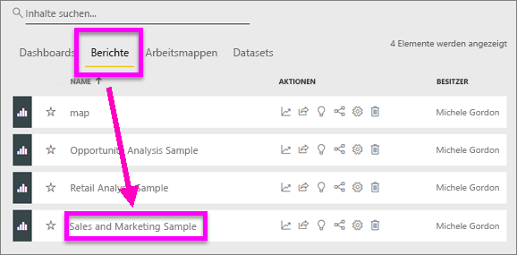
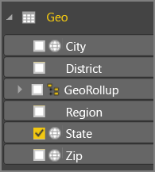
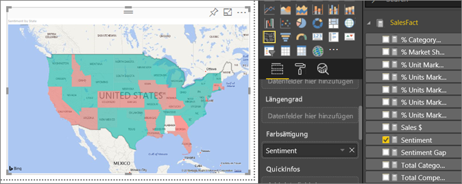
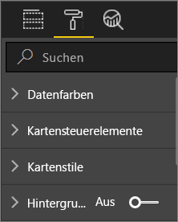
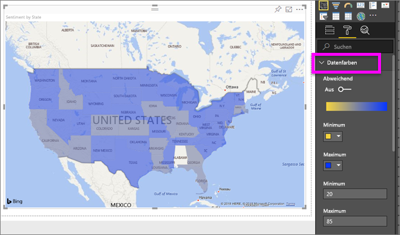
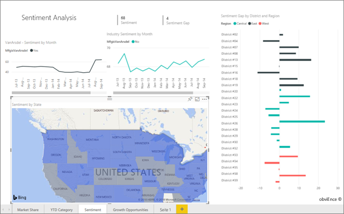
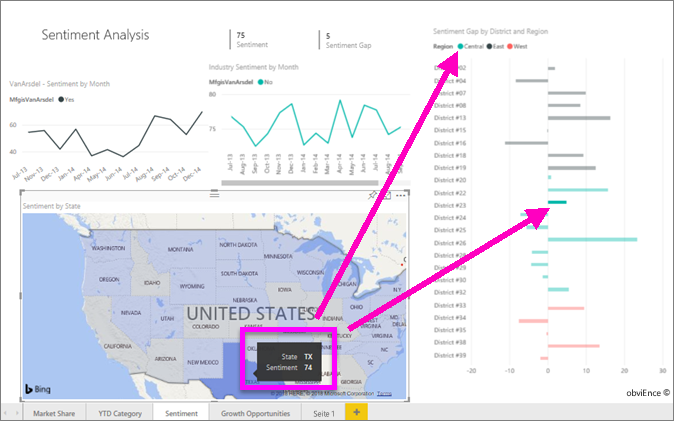
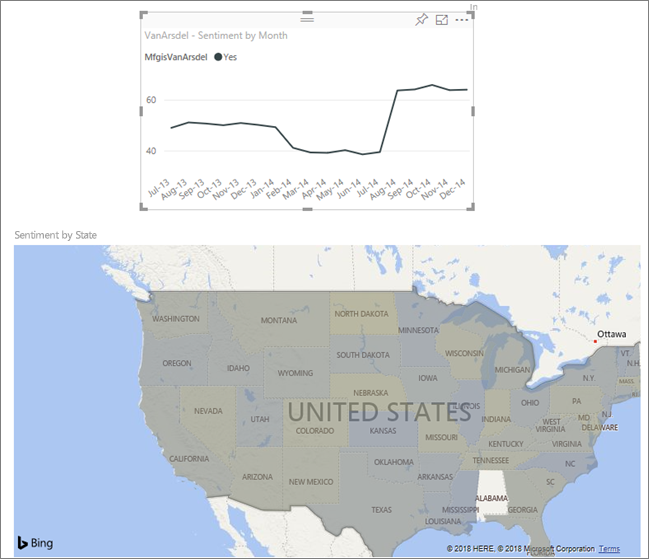

# Flächenkartogramme (Choroplethenkarten) in Power BI
In einem Flächenkartogramm wird mithilfe von Schattierungen, Farben oder Mustern angezeigt, in welchem Verhältnis Werte innerhalb eines geografischen Gebiets stehen.  Diese relativen Unterschiede werden mithilfe von Schattierungen angezeigt, wobei hell eine geringe Menge/Häufigkeit und dunkel eine große Menge/Häufigkeit anzeigt.    

## An Bing gesendete Informationen
Power BI arbeitet mit Bing zusammen, um Standardkartenkoordinaten bereitzustellen (ein Prozess, der als Geocodierung bezeichnet wird). Wenn Sie im Power BI-Dienst oder in Power BI Desktop eine Kartenvisualisierung erstellen, werden die Daten in den Buckets **Standort**, **Breitengrad** und **Längengrad** (die dazu verwendet werden, diese Visualisierung zu erstellen) an Bing gesendet.

Sie oder der Administrator müssen möglicherweise die Firewall aktualisieren, um den Zugriff auf die von Bing für die Geocodierung verwendeten URLs zuzulassen.  Diese URLs lauten:
- https://dev.virtualearth.net/REST/V1/Locations    
- https://platform.bing.com/geo/spatial/v1/public/Geodata    
- https://www.bing.com/api/maps/mapcontrol

Weitere Informationen zu den an Bing gesendeten Daten sowie Tipps für eine erfolgreichere Geocodierung finden Sie unter [Tipps und Tricks für Power BI-Kartenvisualisierungen](power-bi-map-tips-and-tricks.md).

## Einsatz von Flächenkartogrammen
Flächenkartogramme sind gut für folgende Zwecke geeignet:

* Zum Anzeigen quantitativer Informationen auf einer Karte
* Zum Anzeigen räumlicher Muster und Beziehungen
* Bei standardisierten Daten
* Bei der Arbeit mit sozioökonomischen Daten
* Wenn bestimmte Regionen von Bedeutung sind
* Für einen Überblick in Bezug auf die Verteilung über geografische Standorte hinweg

### Voraussetzungen
- Power BI-Dienst oder Power BI Desktop
- Sales and Marketing Sample

Im Tutorial wird der Power BI-Dienst und nicht Power BI Desktop verwendet.

## Erstellen eines grundlegenden Flächenkartogramms
In diesem Video wird eine einfache Karte erstellt und in ein Flächenkartogramm umgewandelt.

<iframe width="560" height="315" src="https://www.youtube.com/embed/ajTPGNpthcg" frameborder="0" allowfullscreen></iframe>

### Abrufen von Daten und Hinzufügen einer neuen leeren Seite zu dem Bericht
1. Um ein eigenes Flächenkartogramm zu erstellen, [laden Sie das Beispiel für Vertrieb und Marketing herunter](../sample-datasets.md). Melden Sie sich zu diesem Zweck bei Power BI an, und wählen Sie **Daten abrufen \> Beispiele \> Vertrieb und Marketing\> Verbinden** aus.
2. Wenn die Erfolgsmeldung angezeigt wird, schließen Sie diese, und klicken Sie auf die Registerkarte **Berichte**. Klicken Sie auf das **Beispiel für Vertrieb und Marketing**, um den Bericht zu öffnen.

   
3. Power BI öffnet den Bericht. Klicken Sie auf **Bericht bearbeiten**, um den Bericht in der [Bearbeitungsansicht](../service-interact-with-a-report-in-editing-view.md) zu öffnen.

4. Fügen Sie eine neue Seite hinzu, indem Sie auf das gelbe Pluszeichen am unteren Rand des Zeichenbereichs klicken.

    

### Erstellen eines Flächenkartogramms
1. Wählen Sie im Bereich „Felder“ das Feld **Geo** \> **Bundesstaat** aus.    

   
5. [Wandeln Sie das Diagramm](power-bi-report-change-visualization-type.md) in ein Flächenkartogramm um. Beachten Sie, dass sich **Bundesstaat** jetzt im Bereich **Standort** befindet. Bing Maps verwendet das Feld unter **Standort**bereich, um die Karte zu erstellen.  Gültige Orte umfassen z. B. Länder, Bundesländer, Landkreise, Städte, Postleitzahlen usw. Bing Maps bietet verschiedene Formen für Orte auf der ganzen Welt. Ohne einen gültigen Wert im Bereich „Ort“ kann Power BI kein Flächenkartogramm erstellen.  

   
6. Filtern Sie die Karte, um nur die kontinentalen USA anzuzeigen.

   a.  Suchen Sie im unteren Teil des Visualisierungsbereichs nach **Filter** .

   b.  Zeigen Sie auf **Bundesland** , und klicken Sie auf das Erweiterungssymbol.  
   

   c.  Aktivieren Sie das Kontrollkästchen **Alle**, und deaktivieren Sie das Kontrollkästchen **AK**.

   
7. Wählen Sie **SalesFact** \> **Stimmung**, um diese Option zum Bereich **Farbsättigung** hinzuzufügen. Das Feld im Bereich **Farbsättigung** steuert die Schattierung der Karte.  
   
8. Das Flächenkartogramm ist grün und rot schattiert. Rot steht dabei für schlechtere und grün für bessere (d.h. positive) Stimmungsdaten.  Wenn Sie Wyoming (WY) markieren, sehen Sie, dass dieser Bundesstaat über einen positiven Stimmungswert (74) verfügt.  
   
9. [Speichern Sie den Bericht](../service-report-save.md).
##    Anpassen der Farbformatierung
Mithilfe von Power BI können Sie die Darstellung Ihres Flächenkartogramms umfassend steuern.
1. Wählen Sie das Farbrollersymbol aus, um den Formatierungsbereich zu öffnen.

    

2. Klicken Sie auf **Datenfarben**, um die Farboptionen anzuzeigen.
3. Legen Sie die Mindest- und Maximalfarben auf gelb und blau fest. Fügen Sie anschließend basierend auf Ihren Daten die Mindest- und Maximalfarben hinzu. Verschieben Sie die Steuerelemente, bis Ihnen das Ergebnis gefällt. 

    

## Hervorheben und Kreuzfiltern
Informationen zur Verwendung des Filterbereichs finden Sie unter [Hinzufügen eines Filters zu einem Bericht in Power BI](../power-bi-report-add-filter.md).

Das Markieren eines Orts in einem Flächenkartogramm ermöglicht das Kreuzfiltern anderer Visualisierungen auf der Berichtsseite – und umgekehrt.

1. Speichern Sie zunächst den Bericht, indem Sie auf **Datei > Speichern** klicken. 

2. Kopieren Sie das Flächenkartogramm, indem Sie STRG+C drücken.

3. Klicken Sie unten im Berichtsbereich auf die Registerkarte **Stimmung**, um die Seite mit dem Stimmungsbericht zu öffnen.

    

4. Bewegen Sie die Visualisierungen auf der Seite, und ändern Sie deren Größe, um Platz zu schaffen. Drücken Sie anschließen STRG+V, um das Flächenkartogramm aus dem vorherigen Bericht einzufügen.

   

5. Wählen Sie auf dem Flächenkartogramm einen Bundesstaat aus.  Dadurch werden die anderen Visualisierungen auf der Seite hervorgehoben. Wenn Sie hier beispielsweise **Texas** auswählen, sehen Sie, dass der Stimmungswert bei 74 liegt. Texas befindet sich im Central District \#23.   
   
2. Wählen Sie in dem Liniendiagramm „VanArsdel - Sentiment by Month“ (VanArsdel – Stimmung nach Monat) aus. Dadurch wird das Flächenkartogramm gefiltert, sodass nur die Stimmungsdaten für VanArsdel und nicht für die Konkurrenz angezeigt werden.  
   

## Zu beachtende Aspekte und Problembehandlung
Kartendaten sind unter Umständen nicht eindeutig.  Neben Paris in Frankreich gibt es auch noch ein Paris in Texas. Ihre geografischen Daten sind wahrscheinlich in separaten Spalten gespeichert – eine Spalte für den Ortsnamen, eine Spalte für den Namen des Bundeslands oder des Landkreises usw. Für Bing ist es daher nicht eindeutig, welches Paris gemeint ist. Wenn das Dataset bereits Daten für die Breiten- und Längengrade enthält, umfasst Power BI spezielle Felder, mithilfe derer die Kartendaten eindeutig zugeordnet werden können. Ziehen Sie das Feld mit den Breitengraddaten in den Bereich „Visualisierungen \> Breitengrad“.  Führen Sie für den Längengrad die gleichen Schritte aus.    

Wenn Sie zum Bearbeiten des Datasets in Power BI Desktop berechtigt sind, erfahren Sie in diesem Video, wie Sie Mehrdeutigkeiten in Karten beheben.

<iframe width="560" height="315" src="https://www.youtube.com/embed/Co2z9b-s_yM" frameborder="0" allowfullscreen></iframe>

Wenn Sie keinen Zugriff auf die Breiten- und Längengraddaten haben, [befolgen Sie diese Anleitung, um Ihr Dataset zu aktualisieren](https://support.office.com/article/Maps-in-Power-View-8A9B2AF3-A055-4131-A327-85CC835271F7).

Weitere Hilfe zu Kartenvisualisierungen finden Sie unter [Tipps und Tricks für Kartenvisualisierungen](../power-bi-map-tips-and-tricks.md).

## Nächste Schritte

[Formenzuordnung](desktop-shape-map.md)

[Visualisierungstypen in Power BI](power-bi-visualization-types-for-reports-and-q-and-a.md)