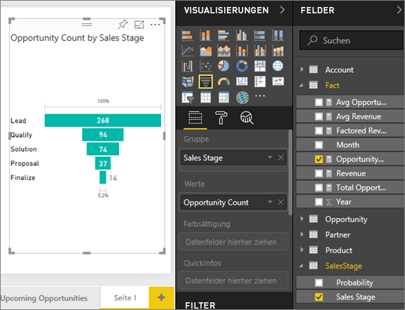
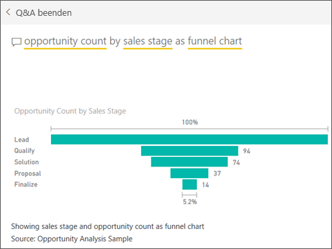

# Trichterdiagramme
Mit einem Trichterdiagramm kann ein linearer Prozess mit aufeinanderfolgenden und miteinander verbundenen Phasen visuell dargestellt werden. Ein Beispiel ist etwa ein Trichterdiagramm für den Verkauf, das die von den Kunden durchlaufenen Phasen nachverfolgt: Lead \> Qualifizierter Lead \> Potenzieller Kunde \> Vertrag \> Abschluss.  Die Form des Trichterdiagramms zeigt auf einen Blick den Zustand des nachverfolgten Prozesses an.

Jede Phase des Diagramms stellt einen prozentualen Anteil am Gesamtwert dar. Daher hat ein Trichterdiagramm in den meisten Fällen die Form eines Trichters, wobei die erste Phase am größten und jede nachfolgende Phase etwas kleiner ist.  Ein birnenförmiges Diagramm ist hilfreich, um ein Problem im Prozess zu identifizieren.  In der Regel ist jedoch die erste Phase (die „Trichteröffnung“) am größten.

## Einsatz von Trichterdiagrammen
Trichterdiagramme sind gut für folgende Zwecke geeignet:

* Bei fortlaufenden Daten über mindestens vier Phasen hinweg
* Bei einer voraussichtlich größeren Anzahl an „Elementen“ in der ersten Phase im Vergleich zur letzten Phase
* Zum Berechnen potenzieller Werte (Umsatz/Verkäufe/Aufträge usw.) nach Phasen
* Zum Berechnen und Nachverfolgen der Konvertierungs- und Kundenbindungsrate
* Zum Erkennen von Engpässen in einem linearen Prozess
* Zum Nachverfolgen des Workflows in Bezug auf den Warenkorb
* Zum Nachverfolgen des Fortschritts und Erfolgs von Click-Through-Werbe-/Marketingkampagnen

## Arbeiten mit Trichterdiagrammen
Trichterdiagramme:

* Können von Berichten und von Q&A angeheftet werden
* Sortierbar
* Vielfachunterstützung
* Hervorheben und Kreuzfiltern durch andere Visualisierungen auf der gleichen Berichtseite möglich
* Verwendung zum Hervorheben und Kreuzfiltern anderer Visualisierungen auf der gleichen Berichtseite möglich

## Erstellen eines einfachen Trichterdiagramms
In diesem Video sehen Sie, wie ein Trichterdiagramm anhand des Beispiels für Vertrieb und Marketing erstellt wird.

<iframe width="560" height="315" src="https://www.youtube.com/embed/qKRZPBnaUXM" frameborder="0" allow="autoplay; encrypted-media" allowfullscreen></iframe>

Erstellen Sie jetzt ein eigenes Trichterdiagramm, das die Anzahl der Verkaufschancen in jeder der Verkaufsphasen anzeigt.

In dieser Anleitung wird das Beispiel zur Opportunityanalyse verwendet. Wenn Sie diese Schritte selbst ausführen möchten, [laden Sie das Beispiel für den Power BI-Dienst („app.powerbi.com“) oder Power BI Desktop herunter](../sample-datasets.md).   

1. Beginnen Sie auf einer leeren Berichtsseite, und wählen Sie **SalesStage** \> **Vertriebsphase** aus. Wenn Sie den Power BI-Dienst verwenden, achten Sie darauf, den Bericht in der [Bearbeitungsansicht](../service-interact-with-a-report-in-editing-view.md) zu öffnen.
   
    
2. [Wandeln Sie das Diagramm](power-bi-report-change-visualization-type.md) in ein Trichterdiagramm um. Beachten Sie, dass sich **Vertriebsphase** im Bereich der **Gruppe** befindet. 
3. Wählen Sie im Bereich **Felder** die Option **Fakt** \> **Anzahl an Verkaufschancen** aus.
   
    
4. Wenn Sie mit dem Mauszeiger auf einen Balken zeigen, werden zahlreiche Informationen angezeigt.
   
   * Name der Phase
   * Anzahl aktueller Verkaufschancen in dieser Phase
   * Gesamte Konversionsrate (% der Leads) 
   * Änderungen zwischen den einzelnen Phasen in Prozent (in diesem Fall zwischen Angebots- und Lösungsphase)
     
     
5. [Fügen Sie den Trichter als Dashboardkachel hinzu](../service-dashboard-tiles.md). 
6. [Speichern Sie den Bericht](../service-report-save.md).

## Hervorheben und Kreuzfiltern
Informationen zur Verwendung des Filterbereichs finden Sie unter [Hinzufügen eines Filters zu einem Bericht in Power BI](../power-bi-report-add-filter.md).

Durch Markieren eines Balkens in einem Trichterdiagramm werden Kreuzfilter zu anderen Visualisierungen auf der Berichtsseite aktiviert und umgekehrt. Fügen Sie hierfür der Berichtsseite, die das Trichterdiagramm enthält, einige weitere visuelle Elemente hinzu.

1. Wählen Sie im Trichterdiagramm den Balken **Angebot** aus. Dadurch erfolgt eine Kreuzhervorhebung der anderen Visualisierungen auf der Seite. Mit STRG können Sie mehrere Elemente auswählen.
   
   
2. Informationen zum Festlegen der Einstellungen für die Kreuzhervorhebung und Kreuzfilterung von visuellen Elementen finden Sie unter [Interaktionen mit Visualisierungen in einem Power BI-Bericht](../service-reports-visual-interactions.md).

## Erstellen eines Trichterdiagramms mithilfe von Q&A
Öffnen Sie das Dashboard für das Beispiel einer Opportunityanalyse oder ein anderes Dashboard, an das eine Visualisierung aus dem Dataset des Beispiels einer Opportunityanalyse angeheftet wurde.  Wenn Sie in Q&A eine Frage eingeben, sucht Power BI in allen dem ausgewählten Dashboard zugeordneten Datasets (d. h. mit Kacheln, die dem Dashboard angeheftet sind) nach Antworten. Weitere Informationen finden Sie unter [Power BI – Grundkonzepte](../service-basic-concepts.md).

1. Geben Sie im Dashboard des Beispiels einer Opportunityanalyse Ihre Frage im Q&A-Fragefeld ein.
   
   
   
2. Fügen Sie „als Trichter“ hinzu, um den bevorzugten Visualisierungstyp anzugeben.

## Nächste Schritte

[Messanzeigen in Power BI](power-bi-visualization-radial-gauge-charts.md)

[Visualisierungstypen in Power BI](power-bi-visualization-types-for-reports-and-q-and-a.md)
