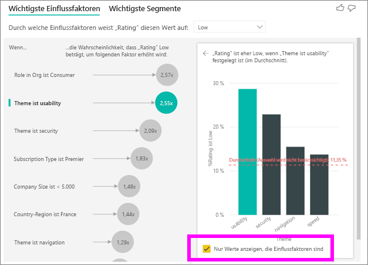
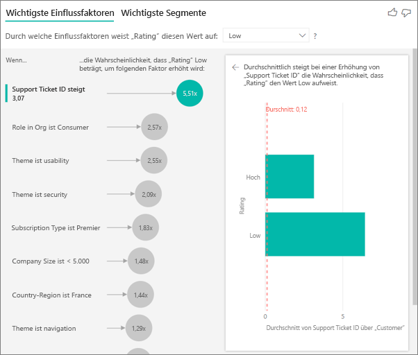
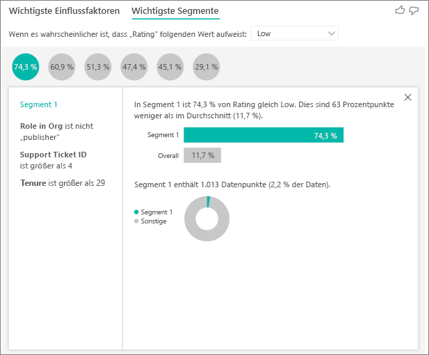
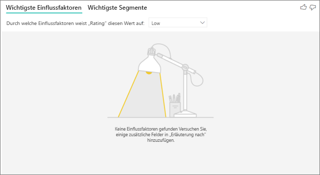
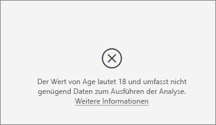
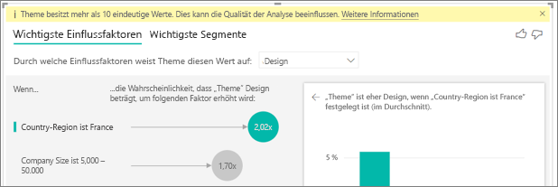

# Visual „Wichtige Einflussfaktoren“
Die wichtigen Einflussfaktoren visual lernen Sie den Faktoren, Laufwerk eine Metrik, die Sie interessiert sind. Es analysiert die Daten, erstellt eine Rangfolge für wichtige Faktoren und stellt diese dar. Nehmen wir beispielsweise an, dass Sie möchten, um zu ermitteln, welche Umsatz pro Mitarbeiter, die ist auch bekannt als codeänderung beeinflusst. Ein Faktor möglicherweise Beschäftigung Vertragslänge und ein weiterer Faktor ist möglicherweise Alter Mitarbeiters. 
 
## Verwenden der wichtige Einflussfaktoren 
Die wichtigen Einflussfaktoren-Visualisierung ist eine gute Wahl, wenn Sie möchten: 
- Sehen Sie, welche Faktoren beeinflussen die die Metrik, die analysiert wird.
- Vergleichen Sie die relative Wichtigkeit dieser Faktoren. z.B. bei der Frage, ob Kurzzeitverträge sich stärker als Langzeitverträge auf die Fluktuation auswirken. 

## Voraussetzungen für das Visual „Wichtige Einflussfaktoren“ 
Die Metrik, die Sie analysieren, muss die Kategorie- oder numerischen Feld (Aggregate und Measures werden noch nicht unterstützt).

## Funktionen des die wichtigen Einflussfaktoren visual

1. **Tabs**: Wählen Sie eine Registerkarte, um zwischen Ansichten zu wechseln. **Wichtige Einflussfaktoren** zeigt Ihnen die wichtigsten Mitwirkenden auf den Wert der ausgewählten Metrik. **Top-Segmente** erfahren Sie, die Top-Segmente, die auf den Wert der ausgewählten Metrik beitragen. Ein *Segment* besteht aus einer Kombination mehrerer Werte. Beispielsweise kann ein Segment Consumer sein, die Kunden mindestens 20 Jahren wurden und befinden sich in der Region West. 

2. **Dropdown-Listenfeld**: Der Wert der Metrik geprüft werden soll. In diesem Beispiel sehen Sie sich die Metrik **Bewertung**. Der ausgewählte Wert ist **niedrig**.

3. **Anpassung**: Damit können Sie das visuelle Element im linken Bereich zu interpretieren.

4. **Im linken Bereich**: Der linke Bereich enthält ein visuelles. In diesem Fall wird im linken Bereich eine Liste mit den oberen wichtigen Einflussfaktoren.

5. **Anpassung**: Damit können Sie das visuelle Element im rechten Bereich zu interpretieren.

6. **Rechten Bereich**: Der rechte Bereich enthält ein visuelles. In diesem Fall das Säulendiagramm zeigt alle Werte für die wichtigsten Schlüsselperson **Design** , die im linken Bereich ausgewählt wurde. Dem spezifischen Wert **benutzerfreundlichkeit** im linken Bereich wird in grün angezeigt. Alle anderen Werte für **Design** in Schwarz angezeigt werden.

7. **Durchschnittslinie**: Der Durchschnitt berechnet wird, für alle anderen möglichen Werte für **Design** außer **benutzerfreundlichkeit**. Die Berechnung setzt sich also aus allen schwarz dargestellten Werten zusammen. Sie erfahren, wie viel Prozent der anderen **Designs** konnten Sie eine niedrige Bewertung. Das heißt, wenn eine Bewertung von einem Kunden übergeben wird, beschreibt dieses Kunden auch den Grund oder Design für die Bewertung. Bei einigen Designs sind benutzerfreundlichkeit, Geschwindigkeit und Sicherheit. 

   **Design ist die benutzerfreundlichkeit** für eine niedrige Bewertung, gemäß der Visualisierung im linken Bereich die zweithöchste Key Schlüsselperson ist. Wenn Sie alle anderen Designs und ihren Beitrag zu einer Bewertung von durchschnittliche **niedrig**, erhalten Sie das Ergebnis in Rot dargestellt. Alle anderen Designs angegeben, sind nur 11.35 % höher als **benutzerfreundlichkeit**.

8. **Aktivieren Sie das Kontrollkästchen**: **Nur die Werte, die Einflussfaktoren anzeigen**.

## Erstellen eines Visuals für wichtige Einflussfaktoren 
 
Sehen Sie sich in diesem Video erfahren, wie Sie einen wichtigen Einflussfaktoren visual erstellen. Klicken Sie dann folgendermaßen Sie vor, um eine zu erstellen. 

<iframe width="560" height="315" src="https://www.youtube.com/embed/fDb5zZ3xmxU" frameborder="0" allow="accelerometer; autoplay; encrypted-media; gyroscope; picture-in-picture" allowfullscreen></iframe>

Ihr Produkt-Manager möchte zu ermitteln, die Faktoren, die Lead-Kunden, um negative Bewertungen zu Ihrem Clouddienst zu verlassen. Öffnen Sie die Datei [customerfeedback.pbix](https://github.com/Microsoft/powerbi-desktop-samples/blob/master/2019/customerfeedback.pbix) in Power BI Desktop, um diesem Tutorial zu folgen. Sie können auch Herunterladen der [Kunden-Feedback-Excel-Datei für Power BI-Dienst oder Power BI Desktop](https://github.com/Microsoft/powerbi-desktop-samples/blob/master/2019/customerfeedback.xlsx). 

> [!NOTE]
> Das Feedback unserer Kunden-DataSet ist basierend auf [Moro Et Al., 2014] s Moro, P. Cortez und P. Rita. "Einen datengesteuerten Ansatz, den Erfolg der Bank Telemarketing vorherzusagen." *Decision Support-Systeme*, Elsevier, 62:22-31, Juni 2014. 

1. Öffnen Sie den Bericht aus, und wählen die **wichtige Einflussfaktoren** Symbol. 

    

2. Verschieben Sie die Metrik, die Sie in untersuchen möchten, die **analysieren** Feld. Die **analysieren** Feld unterstützt nur Kategoriewerte oder noncontinuous, Variablen. Anzeigen des worauf gründet sich die Kunden wählen Sie die Bewertung des Diensts so niedrig, **Customer-Tabelle** > **Bewertung**. 
3. Move-Felder, die Sie denken möglicherweise beeinflussen **Bewertung** in die **Erläutern von** Feld. Sie können so viele Felder, die Sie beliebig verschieben. In diesem Fall beginnen Sie mit:
    - Country-Region 
    - Role in Org (Rolle in der Organisation) 
    - Subscription Type (Abonnementtyp) 
    - Company Size (Unternehmensgröße) 
    - Theme 
1. Um die negative Bewertungen zu konzentrieren, wählen Sie **niedrig** in die **was Bewertung sein beeinflusst** Dropdown-Listenfeld.  

    

Die Analyse wird ausgeführt, auf der Tabelle das Feld, das analysiert wird. In diesem Fall hat der **Bewertung** Metrik. Mit dieser Metrik wird auf einer Kundenebene definiert. Jeder Kunde erhält entweder ein hohes Ergebnis oder eine niedrige Bewertung. Alle erläuternden Faktoren müssen definiert werden, auf der Customer-Ebene für das visuelle Element zu verwenden, die von ihnen. 

Im vorherigen Beispiel haben alle erläuternden Faktoren ein 1: 1- oder eine viele-zu-eins-Beziehung mit der Metrik an. In diesem Fall wurde jedes Ergebnis genau ein Design zugeordnet. Dieses Design ist das wichtigste Thema der Prüfung durch die Kunden. Ebenso stammen Kunden aus einem Land verfügen über eine mitgliedschaftstyp und eine Rolle in ihrer Organisation. Der erläuternden Faktoren sind bereits Eigenschaften eines Kunden und keine Transformationen erforderlich sind. Das visuelle Element kann sofort diese nutzen. 

Weiter unten in diesem Tutorial betrachten Sie komplexere Beispiele, die 1: n Beziehungen verfügen. In diesen Fällen haben die Spalten zuerst auf die Customer-Ebene aggregiert werden, vor dem Ausführen der Analysis aus. 

Measures und Aggregate verwendet, wie erläuternde Faktoren auch auf der Tabellenebene ausgewertet werden die **analysieren** Metrik. Einige Beispiele sind weiter unten in diesem Artikel gezeigt. 

## Interpretieren von kategorischen wichtigen Einflussfaktoren 
Werfen wir einen Blick auf die wichtigen Einflussfaktoren für niedrige Bewertungen. 

### Top Faktor, der die Wahrscheinlichkeit, dass eine niedrige Bewertung beeinflusst.

Die Organisation in diesem Beispiel verfügt über drei Rollen: Consumer, Administrator und Verleger. Als Consumer ist der oberste Faktor, der das eine niedrige Bewertung unterstützt. 

Genauer gesagt, sind Ihre Kunden 2,57 Zeiten eher Geben Sie dem Dienst ein negatives Ergebnis gewertet. Die wichtigen Einflussfaktoren Diagramm Listen **Rolle in der Organisation ist Consumer** zuerst in der Liste auf der linken Seite. Durch Auswahl **Rolle in der Organisation ist Consumer**, Power BI zeigt weitere Details im rechten Bereich. Die komparative Auswirkungen der einzelnen Rollen auf die Wahrscheinlichkeit, dass eine niedrige Bewertung wird angezeigt.
  
- 14.93 % der Verbraucher bieten eine niedrige Bewertung. 
- Die durchschnittliche, bieten alle anderen Rollen eine niedrige Bewertung 5.78 % der Zeit.
- Kunden werden 2,57 Zeiten eher eine niedrige Bewertung, die im Vergleich zu allen anderen Rollen gewähren. Dies kann durch Dividieren der grüne Leiste durch die rote gestrichelte Linie. 

### Zweiten Faktor, der die Wahrscheinlichkeit, dass eine niedrige Bewertung beeinflusst.

Die wichtigen Einflussfaktoren visual vergleicht und Faktoren, die über viele verschiedene Variablen wird die Rangfolge bestimmt. Die zweite Schlüsselperson hat nichts mit **Rolle in der Organisation**. Wählen Sie in der Liste, die ist die zweite Schlüsselperson **Design ist die benutzerfreundlichkeit**. 

Der zweitwichtigste Faktor bezieht sich auf das Design des Kunden überprüfen. Kunden, die über die benutzerfreundlichkeit des Produkts kommentiert waren 2,55 Zeiten eher bieten eine niedrige Bewertung, die im Vergleich zu Kunden, die auf anderen Designs, z.B. die Zuverlässigkeit, Design oder Geschwindigkeit kommentiert. 

Der Durchschnitt, der durch die rote gestrichelte Linie angezeigt wird, werden von 5.78 Prozent 11.34 % geändert, zwischen den visuellen Elementen. Der Durchschnitt ist dynamisch, da sie mit der Durchschnittswert für alle anderen Werte basiert. Für die erste Schlüsselperson ausgeschlossen, der Mittelwert die Customer-Rolle. Für die zweite Schlüsselperson ausgeschlossen es das Design der Nutzbarkeit. 
 
Wählen Sie die **zeigen nur Werte, die Einflussfaktoren** Kontrollkästchen, um zu filtern, indem Sie nur die herausragende Werte. In diesem Fall sind die Rollen, die eine niedrige Bewertung zu steuern. Zwölf Designs werden auf vier reduziert, die Power BI als die Designs zu identifiziert, die niedrige Bewertungen zu steuern. 

## Mit anderen visuellen Elementen interagieren 
 
Jedes Mal, wenn Sie einen Slicer, Filter oder andere Visualisierung im Zeichenbereich auswählen, die wichtigen Einflussfaktoren visual erneutes Ausführen die Analyse auf dem neuen Daten. Sie können z. B. verschieben **Unternehmensgröße** in den Bericht und als einen Slicer verwenden. Verwenden Sie sie an, um festzustellen, ob die wichtigen Einflussfaktoren für Ihre Enterprise-Kunden die allgemeine Population unterscheiden. Eine Enterprise-Unternehmens-Größe ist größer als 50.000 Mitarbeiter.
 
Auswählen von **> 50.000** einem erneutem ausführen, die die Analyse, und Sie sehen, dass sich die Einflussfaktoren geändert. Für große Unternehmenskunden hat die obere Schlüsselperson für niedrige Bewertungen ein Designs, die im Zusammenhang mit Sicherheit. Sie möchten anzeigen zu untersuchen, wenn bestimmte Sicherheitsfeatures, mit denen Ihre große Kunden unglücklich sind vorhanden sind. 

## Interpretieren von kontinuierlichen wichtigen Einflussfaktoren 
 
Bisher haben Sie gesehen, wie das visuelle Element zu verwenden, um verschiedenen Kategoriefelder zu untersuchen. niedrige Bewertungen zu beeinflussen. Es ist auch möglich, damit der fortlaufende Faktoren wie Alter, Größe und Preis in der **Erläutern von** Feld. Sehen wir uns, was geschieht, wenn **Anstellung** verschoben wird, aus der Customer-Tabelle in **wird erläutert, durch**. Haben sich zeigt, wie lange ein Kunde hat der Dienst verwendet. 
 
Mit zunehmender Anstellung erhöht die Wahrscheinlichkeit, dass eine niedrigere Bewertung auch. Dieser Trend schlägt vor, dass die längerfristigen Kunden wahrscheinlich ein negatives Ergebnis zu erhalten. Diese Information ist interessant, und eine, die Sie später nachverfolgen möchten. 
 
Die Visualisierung zeigt, dass jedes Mal, wenn Beschäftigungsdauer von 13.44 Monate steigt, durchschnittlich die Wahrscheinlichkeit von eine niedrige Bewertung von 1,23 Zeiten erhöht. In diesem Fall stellen 13,44 Monate die Standardabweichung der Verwendungsdauer dar. Daher, wie die Einblicke, die Sie erhalten untersucht haben sich zu erhöhen, indem eine standard-Menge, die die Standardabweichung der Anstellung ist, wirkt sich auf die Wahrscheinlichkeit, dass eine niedrige Bewertung. 
 
Das Punktdiagramm im rechten Bereich sind die durchschnittliche prozentuale niedrige Bewertungen für jeden Wert von mitarbeiten. Es werden die Steigung mit einer Trendlinie hervorgehoben.

## Interpretieren von Measures und Aggregate wie wichtigen Einflussfaktoren 
 
Sie können Measures und Aggregate als erläuternde Faktoren in der Analyse verwenden. Beispielsweise empfiehlt es sich um festzustellen, welche Auswirkungen die Anzahl der Kunden Support-Tickets oder die durchschnittliche Dauer der ein open-Ticket für die Bewertung hat Sie erhalten. 
 
In diesem Fall möchten Sie überprüfen, ob die Anzahl der Support-Tickets, die ein Kunde verfügt über das Ergebnis wirkt sich darauf aus, die Sie geben. Nachdem Sie importieren **Ticket-ID unterstützen** aus der Support-Ticket-Tabelle. Da ein Kunde mehrere Support-Tickets enthalten kann, aggregieren Sie die ID, die die Stufe anpassen. Aggregation ist wichtig, da die Analyse auf der Kundenebene wird ausgeführt, sodass alle Treiber, die auf dieser Ebene der Granularität definiert werden müssen. 
 
Betrachten Sie die Anzahl der IDs ein. Jede Kundenzeile verfügt über eine Anzahl von Support-Tickets zugeordnet. In diesem Fall als die Anzahl der Support-Tickets zunimmt, steigt die Wahrscheinlichkeit, dass der Bewertung, niedrige 5.51 Zeiten. Das visuelle Element auf der rechten Seite zeigt die durchschnittliche Anzahl von Support-Tickets von anderen **Bewertung** auf Kundenebene ausgewertet. 

## Interpretieren der Ergebnisse: Wichtigste Segmente 
 
Sie können die **wichtige Einflussfaktoren** Tab, um die einzelnen Faktoren einzeln zu bewerten. Außerdem können Sie die **wichtigsten Segmente** Registerkarte, um anzuzeigen, wie eine Kombination von Faktoren für die Metrik auswirkt, die Sie analysieren. 
 
Top-Segmente zeigen Anfangs, einen Überblick über alle Segmente, die Power BI ermittelt. Das folgende Beispiel zeigt, dass sechs Segmente gefunden wurden. Diese Segmente werden anhand des Prozentsatzes der niedrige Bewertungen innerhalb des Segments geordnet. 1-Segment hat z. B. 74.3 % Kunden Bewertungen zusammengefasst, die niedrig sind. Je höher der Kreis positioniert ist, desto größer ist der Anteil der niedrigen Bewertungen. Die Größe der Blase stellt dar, wie viele Kunden innerhalb des Segments sind. 

Wenn Sie auf einen Kreis klicken, werden die Details zu diesem Segment angezeigt. Wenn Sie Segment 1 auswählen, z. B. finden Sie, dass es relativ etablierte Kunden besteht. Sie haben bereits Kunden mehr als 29 Monate und haben mehr als vier Support-Tickets. Schließlich sind nicht Herausgeber, sodass sie entweder Benutzer oder Administratoren sind. 
 
In dieser Gruppe haben 74.3 % der Kunden eine niedrige Bewertung. Der durchschnittliche Kunde hat einen niedrigen Bewertung von 11,7 % der Zeit, sodass dieses Segment einen größeren Anteil niedrige Bewertungen hat. 63 Prozentpunkten höher ist. 1-Segment enthält auch etwa 2.2 % der Daten, damit einen adressierbaren Teil der Auffüllung darstellt. 

## Arbeiten mit numerischen Daten

Wenn Sie ein numerisches Feld in Verschieben der **analysieren** Feld, Sie haben die Wahl dieses Szenario zu behandeln. Sie können das Verhalten des visuellen Elements ändern, indem Sie in der **Formatierung im Bereich** und zum Wechsel zwischen **Kategorietyp Analysis** und **fortlaufende Analysetyp**.

Ein **Kategorietyp Analysis** wie oben beschrieben verhält. Z. B. Wenn Sie an der Umfrage-Bewertungen im Bereich von 1 bis 10 suchen, Fragen Sie "Was Umfrage Bewertungen 1 wirkt sich darauf aus?"

Ein **fortlaufende Analysetyp** ändert sich die Frage zu einem kontinuierlichen. Im obigen Beispiel wäre unsere neue Frage "Was Umfrage Bewertungen zu erhöhen oder verringern, wirkt sich darauf aus?"

Diese Unterscheidung ist sehr hilfreich, wenn Sie viele der eindeutigen Werte im Feld verfügen, das Sie analysieren. Im folgenden Beispiel betrachten wir die Preise für Haus ein. Es ist nicht sehr sinnvoll zu Fragen "Was Haus Preis 156,214 sein wirkt sich darauf aus?" wie geht das sehr sind spezifisch, und wir wahrscheinlich nicht genügend Daten für ein Muster abzuleiten.

Stattdessen könnten wir Fragen: "Was beeinflusst Haus Preis erhöhen"? die uns ermöglicht, House Preise als eine Reihe unterschiedlicher Werte behandelt werden sollen.

## Interpretieren der Ergebnisse: Wichtigste Einflussfaktoren 

In diesem Szenario betrachten wir "Was Haus Preis erhöhen wirkt sich auf". Wir möchten eine Reihe von erklärendem Faktoren, die einen Haus Preis wie auswirken können **Jahr erstellt** (Jahr das Haus erstellt wurde), **KitchenQual** (Küche Qualität) und **YearRemodAdd** (Jahr, die das Haus überarbeitet wurde). 

Im folgenden Beispiel betrachten wir unsere oberste Schlüsselperson die Küche Qualität wird sehr gut ist. Die Ergebnisse sind sehr ähnlich jenen, die wir gesehen haben, wenn wir nach Kategorien sortierte Metriken mit ein paar wichtige Unterschiede analysiert wurden:

- Die Durchschnittswerte anstelle von Prozentsätzen ist das Säulendiagramm auf der rechten Seite betrachten. Es wird daher der uns was die durchschnittliche Haus Preis eines Hauses mit einem hervorragenden Küche (Leiste Grün) ist im Vergleich zu den durchschnittlichen Haus Preis eines Hauses ohne eine ausgezeichnete Küche (gepunkteten Linie)
- Die Anzahl der im Blasendiagramm ist der Unterschied zwischen der rote gepunktete Linie und Balken bzw. hellgrünes Band, aber als Zahl ausgedrückt wird ($158. 49K) anstatt eine Wahrscheinlichkeit (1.93 X). Durchschnittliche usw., enthält mit hervorragenden Küchen fast $160 KB teurer als Häuser ohne ausgezeichnete Küchen.

Im folgenden Beispiel, das wir die Auswirkungen betrachten, ist ein kontinuierliche Faktor (Jahr, die Haus überarbeitet wurde) auf Preis des Hauses. Die Unterschiede im Vergleich zu wie analysieren wir die fortlaufende Einflussfaktoren für kategorische Metriken lauten wie folgt aus:

-   Das Punktdiagramm im rechten Bereich sind die durchschnittliche Haus Preis für jeden eindeutigen Wert des Jahres überarbeitet. 
-   Der Wert in der Blase angezeigt wird, um wie viel durchschnittliche Haus Preis erhöht wird (in diesem Fall 2 USD. 87-k) Wenn das Jahr das Haus war erhöht überarbeitet, durch die Standardabweichung (in diesem Fall 20 Jahre)

Im Fall von Measures, die wir das durchschnittliche Jahr betrachten wurde schließlich ein Haus erstellt. Die Analyse hier lautet wie folgt aus:

-   Punktdiagramm im rechten Bereich stellt die durchschnittliche Haus Preis für jeden eindeutigen Wert in der Tabelle
-   Der Wert in der Blase angezeigt wird, um wie viel durchschnittliche Haus Preis erhöht wird (in diesem Fall 1 USD. 35K) Wenn die durchschnittliche Jahr erhöht, die Standardabweichung (in diesem Fall 30 Jahre)

## Interpretieren der Ergebnisse: Top-Segmente

Top-Segmente sind für numerische Ziele Gruppen angezeigt, in dem das Haus durchschnittlich Preise höher als für das gesamte Dataset. Z. B. im folgenden sehen wir, dass **Segment 1** Häuser bestehen, in denen **GarageCars** (Anzahl der Autos, die die Garage passt) ist größer als 2 und die **RoofStyle** Hip ist. Häusern mit diesen Eigenschaften verfügen über einen Durchschnittspreis von 355 Dollar im Vergleich zu den allgemeinen Durchschnitt in die Daten, die 180 $K.

## Zu beachtende Aspekte und Problembehandlung 
 
**Was sind die Einschränkungen für die Vorschauversion?** 
 
Die wichtigen Einflussfaktoren visual befindet sich derzeit in der öffentlichen Vorschau, und es gelten einige Einschränkungen. Enthält von Funktionen, die zurzeit nicht verfügbar ist: 
- Analyse von Metriken, die Aggregate oder Measures sind.
- Nutzen die Visualisierung in Power BI Embedded.
- Nutzen die Visualisierung für Power BI-mobile-apps.
- RLS unterstützt.
- Direkten Sie Unterstützung von Abfragen.
- Live-Verbindung unterstützt.

**Wird ein Fehler angezeigt, den keine Einflussfaktoren oder Segmente gefunden wurden. Wieso?** 

Dieser Fehler tritt auf, wenn Sie Felder in enthalten **Erläutern von** , aber keine Einflussfaktoren gefunden wurden. 
- Sie enthalten die Metrik, die Sie analysieren wurden in beiden **analysieren** und **Erläutern von**. Entfernen Sie sie aus **Erläutern von**. 
- Die erläuternden Felder enthalten zu viele Kategorien, in denen nur wenige Beobachtungen vorhanden sind. Diese Situation wird es schwierig, für die Visualisierung, um zu bestimmen, welche Faktoren Einflussfaktoren sind. Es ist schwierig, um basierend auf nur einige Beobachtungen zu generalisieren. Wenn Sie ein numerisches Feld analysieren möchten von wechseln **kategorische Analysis** zu **fortlaufende Analyse** in die **Formatierung im Bereich** unter der  **Analyse** Karte.
- Ihre erläuternden Faktoren haben genug Beobachtungen zu verallgemeinern, aber die Visualisierung haben sinnvollen Korrelationen zu Bericht nicht gefunden.
 
**Wird ein Fehler angezeigt, dass genügend Daten für die Analyse führen Sie auf die Metrik, die analysieren, ich bin, nicht. Wieso?** 

Die Visualisierung funktioniert, indem Muster in den Daten für eine Gruppe, die im Vergleich zu anderen Gruppen. Beispielsweise sieht es für Kunden, die niedrige Bewertungen, die im Vergleich Kunden gegeben haben, die hohe Bewertungen gegeben haben. Wenn die Daten in Ihrem Modell nur einige Beobachtungen verfügt, sind Muster schwer zu finden. Wenn die Visualisierung genügend Daten für aussagekräftige Einflussfaktoren gefunden hat, bedeutet dies, dass es sich bei mehr Daten benötigt werden, um die Analyse auszuführen. 

Es wird empfohlen, dass Sie über mindestens 100 Vorkommen für den ausgewählten Status haben. In diesem Fall ist der Zustand, Kunden, die codeänderung. Außerdem benötigen Sie mindestens 10 Beobachtungen, für die Zustände, die Sie für den Vergleich verwenden. In diesem Fall ist der Vergleich Kunden, die codeänderung nicht.

Wenn Sie ein numerisches Feld analysieren möchten von wechseln **kategorische Analysis** zu **fortlaufende Analyse** in die **Formatierung im Bereich** unter der  **Analyse** Karte.

**Tritt ein Fehler, die ein Feld in *Erläutern von* ist nicht eindeutig im Zusammenhang mit der die Tabelle, die Metrik enthält, ich bin analysieren. Wieso?**
 
Die Analyse wird ausgeführt, auf der Tabelle das Feld, das analysiert wird. Z. B. Wenn Sie für Ihren Dienst Feedback von Kunden analysieren, müssen Sie eine Tabelle möglicherweise, die anzeigt, ob ein Kunde eine hohe Bewertung oder eine niedrige Bewertung gegeben haben. In diesem Fall wird die Analyse auf der Ebene der Customer-Tabelle ausgeführt. 

Wenn Sie eine verknüpfte Tabelle, die definiert, wird auf einer präziseren Ebene als die Tabelle, die Ihre Metrik enthält verfügen, wird dieser Fehler angezeigt. Es folgt ein Beispiel aus: 
 
- Sie analysieren, worauf gründet sich die Kunden gerne niedrige Bewertungen Ihres Diensts.
- Um festzustellen, ob das Gerät, auf dem der Kunde den Dienst nutzt, die Überprüfungen wirkt sich darauf aus, die sie erhalten, werden sollen.
- Ein Kunde kann den Dienst auf mehrere Arten nutzen.
- Im folgenden Beispiel verwendet Kunden 10000000 sowohl einen Browser und einem Tablet liegen, um mit dem Dienst interagieren.

Wenn Sie versuchen, die Gerätespalte als eine erläuternde Faktor zu verwenden, der folgende Fehler angezeigt: 

Dieser Fehler wird angezeigt, da das Gerät nicht auf der Kundenebene definiert ist. Ein Kunde kann den Dienst auf mehreren Geräten zu nutzen. Für die Visualisierung, um Muster zu finden muss das Gerät ein Attribut des Kunden sein. Es gibt mehrere Lösungen, die von Ihr Verständnis des Unternehmens abhängen: 
 
- Sie können die Zusammenfassung der Geräte, die zu zählenden ändern. Verwenden Sie z. B. die Anzahl auf, wenn die Anzahl der Geräte das Ergebnis beeinflussen kann, die ein Kunden bietet. 
- Sie können die Gerätespalte, um festzustellen, ob die Nutzung des Diensts auf einem bestimmten Gerät eines Kunden Bewertung wirkt sich darauf aus pivotieren.
 
In diesem Beispiel wurde dem Anwenden der Pivotierung zum Erstellen neuer Spalten für Browser, mobile und tablet. Nun können Sie diese Geräte in **Erläutern von**. Alle Geräte erweisen sich Einflussfaktoren werden, und der Browser hat die größten Auswirkungen auf Kunden-Bewertung.

Genauer gesagt, sind Kunden, die den Browser verwenden, um den Dienst zu nutzen 3,79 Zeiten eher eine niedrige Bewertung als die Kunden zu erhalten, die. Weiter unten in der Liste für mobile Geräte das Gegenteil gilt. Kunden, die die mobile app verwenden, sind eher eine niedrige Bewertung als Kunden weitergeben können, die nicht. 

**Ich sehe es sich um eine Warnung, dass Maßnahmen in Meine Analyse berücksichtigt wurden. Wieso?** 

Die Analyse wird ausgeführt, auf der Tabelle das Feld, das analysiert wird. Wenn Sie kundenabwanderung zu analysieren, müssen Sie möglicherweise eine Tabelle, die anzeigt, ob ein Kunde oder nicht verarbeiteten. In diesem Fall führt die Analyse auf der Ebene der Customer-Tabelle ein.
 
Measures und Aggregate sind standardmäßig auf Tabellenebene analysiert. Würde ein Maß für die durchschnittliche monatlichen Ausgaben, würden sie auf der Ebene der Customer-Tabelle analysiert werden. 

Wenn die Customer-Tabelle nicht über einen eindeutigen Bezeichner verfügt, wird Sie das Measure können nicht ausgewertet werden, und es wird von der Analyse ignoriert. Um diese Situation zu vermeiden, stellen Sie sicher, dass die Tabelle mit die Metrik einen eindeutigen Bezeichner verfügt. In diesem Fall ist der Customer-Tabelle und der eindeutige Bezeichner ist die Kunden-ID. Es ist auch einfach eine Indexspalte hinzufügen, indem Sie mithilfe von Power Query.
 
**Ich sehe es sich um eine Warnung, dass die Metrik, die ich analysieren bin, mehr als 10 eindeutige Werte verfügt und diese Menge die Qualität der meine Analyse beeinflussen kann. Wieso?** 

Die KI-Visualisierung kann Kategoriefelder und numerischen Feldern analysieren. Im Fall von Kategoriefelder, ein Beispiel ist möglicherweise Abwanderung ist Ja oder Nein und Kundenzufriedenheit ist hoch, Mittel oder niedrig. Erhöhen der Anzahl von Kategorien zum Analysieren von bedeutet, dass es weniger Vorkommen pro Kategorie. Dies erschwert es für die Visualisierung, um Muster in den Daten zu finden. 

Bei der Analyse von numerischer Feldern haben Sie die Wahl zwischen behandeln die numerischen Felder wie Text in diesem Fall die gleiche Analyse ausgeführt wird, wie für kategorische Daten (**kategorische Analysis**). Wenn Sie viele unterschiedliche haben wechseln Werte, die wir Ihnen empfehlen die Analyse **fortlaufende Analyse** wie also können wir ableiten, Muster, wenn Zahlen erhöhen oder verringern, sondern behandelt sie als unterschiedliche Werte aus. Sie können von wechseln **kategorische Analysis** zu **fortlaufende Analyse** in die **Formatierung im Bereich** unter der **Analysis** Karte.

Um eine stärkere Einflussfaktoren zu suchen, empfehlen wir die Gruppierung von ähnlichen Werten in einer einzelnen Einheit. Wenn Sie eine Metrik für Preis haben, können Sie beispielsweise wahrscheinlich bessere Ergebnisse zu erzielen, indem ähnliche Preise zu hoch, Mittel und niedrig Kategorien und der einzelnen Tarife gruppiert. 

**Es gibt Faktoren in meinen Daten, die aussehen, wie sie die wichtigen Einflussfaktoren sein soll, aber es sind keine. Wie kann es dazu kommen?**

Im folgenden Beispiel das Laufwerk Kunden, die Kunden sind niedriger Bewertungen, mit dem 14.93 % von Bewertungen, die mit niedriger sind. Die Rolle "Administrator" verfügt auch über ein hoher Anteil von niedrige Bewertungen, bei 13.42 % aus, aber es ist kein Schlüsselperson angesehen. 

Der Grund für diese Entscheidung ist, dass die Visualisierung auch die Anzahl der Datenpunkte, berücksichtigt Wenn Einflussfaktoren gefunden. Das folgende Beispiel enthält 29.000 Consumer und 10 Mal weniger Administratoren, etwa 2,900. Nur 390 davon hat eine niedrige Bewertung. Das visuelle Element verfügt nicht über genügend Daten, um zu bestimmen, ob es sich um ein Muster mit Administrator-Bewertungen gefunden oder ist dies nur eine Chance suchen. 

**Wie berechnet Sie die wichtige Einflussfaktoren für kategorische Analysis?**

Hinter den Kulissen wird die AI-Visualisierung verwendet [ML.NET](https://dotnet.microsoft.com/apps/machinelearning-ai/ml-dotnet) zum Ausführen einer logistischen Regression, um die wichtigen Einflussfaktoren zu berechnen. Bei einer logistischen Regression handelt es sich um ein Statistikmodell, das verschiedene Gruppen miteinander vergleicht. 

Wenn Sie möchten sehen, worauf gründet sich die niedrige Bewertungen, untersucht die logistische Regression von Kunden wie Kunden, die eine niedrige Bewertung gegeben haben sich unterscheiden, die eine hohe Bewertung gegeben haben. Wenn Sie mehrere Kategorien, z. B. Höchst-, neutral und niedrige Bewertung haben, die Sie von Kunden wie die Kunden, die eine niedrige Bewertung gegeben haben zu unterscheiden, die eine niedrige Bewertung geben nicht betrachten. In diesem Fall wie die Kunden, die eine niedrige Bewertung gegeben haben Kunden unterscheiden sich von, die eine hohe Bewertung oder eine neutrale Bewertung gegeben haben? 
 
Die logistische Regression sucht nach Mustern in den Daten und sucht, wie Kunden, die eine niedrige Bewertung gegeben haben von Kunden, die eine hohe Bewertung gegeben haben, unterscheiden können. Es kann, z. B. feststellen, dass Kunden mit mehr supporttickets auf einen höheren Prozentsatz der niedrige Bewertungen als Kunden mit wenigen oder gar keinen Support-Tickets gewähren.
 
Die logistische Regression wird auch berücksichtigt, wie viele Datenpunkte vorhanden sind. Beispielsweise ist nicht Wenn Kunden, die eine Administratorrolle spielen proportional mehr negative Bewertungen bieten, aber es nur wenige Administratoren gibt, dieser Faktor fahrradkäufen betrachtet. Diese Ermittlung erfolgt, da es nicht genügend Datenpunkte verfügbar sind, um ein Muster abzuleiten. Ein statistischer Test, bekannt als Test Wald, wird verwendet, um festzustellen, ob ein Faktor eine Schlüsselperson betrachtet wird. Im Visual wird ein p-Wert von 0,05 verwendet, um den Schwellenwert zu berechnen. 

**Wie berechnet Sie die wichtige Einflussfaktoren für numerische Analyse?**

Hinter den Kulissen wird die AI-Visualisierung verwendet [ML.NET](https://dotnet.microsoft.com/apps/machinelearning-ai/ml-dotnet) auszuführende eine lineare Regression, um die wichtigen Einflussfaktoren zu berechnen. Eine lineare Regression ist ein statistikmodell, die untersucht, wie das Ergebnis des Felds, das Sie analysieren, werden Änderungen auf Ihre erläuternden Faktoren basieren.

Wenn wir Haus Preise analysieren, wird z. B. eine lineare Regression sehen Sie sich die Auswirkungen müssen eine ausgezeichnete Küche auf den Preis des Hauses haben. Haben Häusern mit hervorragenden Küchen in der Regel niedrigere oder höhere Haus Preise im Vergleich zu Häuser ohne ausgezeichnete Küchen?

Die lineare Regression berücksichtigt auch die Anzahl der Datenpunkte an. Z. B. wenn Häusern mit Tennis Gerichtsstand der höheren Gerichtsinstanz höhere Preise haben, aber wir haben nur sehr wenige enthält, die ein Gericht geht, dieser Faktor fahrradkäufen gilt nicht. Diese Ermittlung erfolgt, da es nicht genügend Datenpunkte verfügbar sind, um ein Muster abzuleiten. Ein statistischer Test, bekannt als Test Wald, wird verwendet, um festzustellen, ob ein Faktor eine Schlüsselperson betrachtet wird. Im Visual wird ein p-Wert von 0,05 verwendet, um den Schwellenwert zu berechnen. 

**Wie werden Segmente berechnet?**

Hinter den Kulissen wird die AI-Visualisierung verwendet [ML.NET](https://dotnet.microsoft.com/apps/machinelearning-ai/ml-dotnet) eine Entscheidungsstruktur finden Sie interessante Untergruppen ausgeführt. Das Ziel der Entscheidungsstruktur wird mit einer Untergruppe von Datenpunkten, die in der Metrik relativ hoch ist, die Sie interessiert sind. Kunden mit niedrige Bewertungen oder Häusern mit hohe Preise besitzen möglicherweise.

Die Entscheidungsstruktur erläuternde jeder dieser Faktoren und versucht, welcher Faktor sie das beste erhalten, Grund *teilen*. Z. B. Wenn Sie die Daten, um nur große Enterprise-Kunden filtern, werden, die Kunden zu trennen, die eine hohe Bewertung und eine niedrige Bewertung gegeben haben? Oder ist es möglicherweise besser, Filtern die Daten, um nur Kunden zählen, die kommentiert, über die Sicherheit? 

Nachdem Sie die Entscheidungsstruktur eine Teilung der Fall ist, wird die Untergruppe von Daten und bestimmt die nächste beste Teilung für diese Daten. In diesem Fall wird die Untergruppe "Kunden, die zur Sicherheit kommentiert. Nach jeder Aufteilung betrachtet sie als auch, ob genügend Datenpunkte für diese Gruppe ausreichend Vertreter abzuleiten, ein Muster aus oder gibt an, ob es sich um eine Anomalie in der Daten und nicht auf einem echten Segment ist sein kann. Einen anderen statistischer Test wird angewendet, um die statistische Bedeutung der teilungsbedingung mit p-Wert von 0,05 zu finden. 

Klicken Sie nach die Entscheidungsstruktur akzeptiert alle die Teilungen zusammen, wie z. B. Sicherheit Kommentare und großen Unternehmen, und erstellt Power BI-Filter. Diese Filter werden im Visual zu einem Segment kombiniert. 
 
**Warum bestimmte Faktoren Einflussfaktoren bzw. Beenden Einflussfaktoren wird, wenn ich weitere Felder in Bewegen der *Erläutern von* Feld?**

Das Visual wertet alle erläuternden Faktoren zusammen aus. Ein Faktor ist möglicherweise ein Schlüsselperson selbst, aber wenn er mit anderen Faktoren gilt es ist u. u. nicht. Angenommen, Sie möchten zum Analysieren des worauf gründet sich einen Haus Preis hoch sein, mit Schlafzimmern und einer Größe von Haus als erläuternde Faktoren wird:

- Selbst möglicherweise weitere Schlafzimmer einen Treiber für Haus Preise hoch ist.
- Einschließlich House-Größe in der Analyse bedeutet, dass Sie jetzt sehen Sie sich, was geschieht mit Schlafzimmer, während die Größe des Hauses konstant bleibt.
- Wenn Haus Größe am 1.500 Quadratfuß festgelegt ist, ist es unwahrscheinlich, dass eine kontinuierliche Anstieg der Anzahl von Schlafzimmern – den Preis des Hauses erheblich erhöht wird. 
- Schlafzimmern sind möglicherweise nicht in der einen Faktor so wichtig wie vor Haus Größe betrachtet wurde. 

## Nächste Schritte
- [Kombinationsdiagramm in Power BI](power-bi-visualization-combo-chart.md)
- [Visualisierungstypen in Power BI](power-bi-visualization-types-for-reports-and-q-and-a.md)
