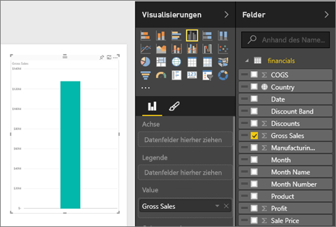
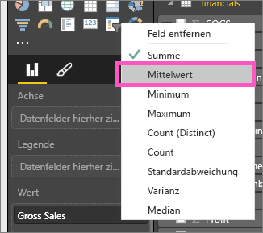
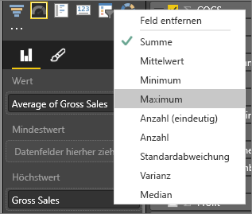
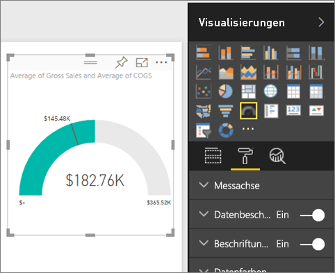
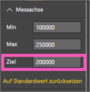

# Radialmessgerät-Diagramme in Power BI
Ein Diagramm für ein radiales Messgerät verfügt über einen Kreisbogen und zeigt einen einzelnen Wert an, mit dem der Fortschritt bei Erreichen eines Ziels oder KPI-Werts gemessen wird.  Das Ziel bzw. der Zielwert wird durch die Linie (Nadel) dargestellt. Der Fortschritt zur Erreichung des Ziels wird durch die Schattierung dargestellt.  Der Wert, der für diesen Fortschritt steht, ist innerhalb des Bogens in Fettschrift angegeben. Alle möglichen Werte sind gleichmäßig auf den Bogen verteilt, vom kleinsten Wert (ganz links) bis zum höchsten Wert (ganz rechts).

Im Beispiel unten fungieren wir als Autohändler, der die durchschnittlichen Verkäufe seines Vertriebsteams pro Monat verfolgt. Unser Ziel ist der Wert 140, der durch die schwarze Nadel angegeben ist.  Der kleinste Wert für die durchschnittlichen Verkäufe ist 0, und der höchste Wert ist auf 200 festgelegt.  Die blaue Schattierung zeigt, dass im aktuellen Monat derzeit ein Durchschnitt von ca. 120 Verkäufen erzielt wurde. Glücklicherweise ist noch eine Woche Zeit, um unser gestecktes Ziel zu erreichen.

## Einsatzmöglichkeiten für ein radiales Messgerät
Radiale Messgeräte sind gut für folgende Zwecke geeignet:

* Anzeigen des Fortschritts zur Erreichung eines Ziels
* Darstellen eines Quantil-Measures, z. B. eines KPI
* Anzeigen der Integrität eines Measures
* Anzeigen von Informationen, die schnell überblickt und verstanden werden

### Voraussetzungen
 - Power BI-Dienst oder Power BI Desktop
 - Excel-Arbeitsmappe mit Finanzbeispiel: [Laden Sie das Beispiel direkt herunter](http://go.microsoft.com/fwlink/?LinkID=521962).

## Erstellen eines einfachen radialen Messgeräts
In dieser Anleitung wird der Power BI-Dienst verwendet. Um die Schritte durchzuführen, melden Sie sich bei Power BI an, und öffnen Sie die Excel-Datei mit dem Finanzbeispiel.  

Oder schauen Sie Will beim Erstellen von Einzelmetrik-Visualisierungen wie Messgeräten, Karten und KPIs zu.

<iframe width="560" height="315" src="https://www.youtube.com/embed/xmja6EpqaO0?list=PL1N57mwBHtN0JFoKSR0n-tBkUJHeMP2cP" frameborder="0" allowfullscreen></iframe>

### Schritt 1: Öffnen der Excel-Datei mit dem Finanzbeispiel
1. [Laden Sie die Excel-Finanzbeispieldatei herunter](../sample-financial-download.md), falls Sie dies noch nicht getan haben. Merken Sie sich, wo Sie sie gespeichert haben.

2. Öffnen Sie die Datei im ***Power BI-Dienst***, indem Sie **Daten abrufen \> Dateien** auswählen und zu dem Speicherort wechseln, an dem Sie die Datei gespeichert haben. Wählen Sie **Importieren** aus. Das Finanzbeispiel wird Ihrem Arbeitsbereich als Dataset hinzugefügt.

3. Wählen Sie in der Inhaltsliste **Dataset** das **Beispiel zu den Finanzen** aus, um es im Untersuchungsmodus zu öffnen.

    

### Schritt 2: Erstellen eines Tachometerdiagramms zum Nachverfolgen des Bruttoumsatzes
1. Wählen Sie im Bereich **Felder** die Option **Bruttoumsatz**.
   
   
2. Ändern Sie die Aggregation in **Mittelwert**.
   
   
3. Wählen Sie das Symbol „Messgerät“  aus, um das Säulendiagramm in ein Messgerät umzuwandeln.
   
   Power BI erstellt standardmäßig ein Messgerätdiagramm, in dem der aktuelle Wert (hier: Mittelwert des Bruttoumsatzes) in der Mitte der Messgerätskala angeordnet ist. Da der durchschnittliche Bruttoumsatz 182.760 US-Dollar beträgt, ist der Startwert (Minimum) auf 0 und der Endwert (Maximum) auf das Doppelte des aktuellen Werts festgelegt.
   
   

### Schritt 3: Festlegen eines Zielwerts
1. Ziehen Sie **COGS** in den Bereich **Zielwert** .
2. Ändern Sie die Aggregation in **Mittelwert**.
   Power BI fügt eine Nadel hinzu, um den Zielwert von **145.480 US-Dollar**anzugeben. Sie sehen also, dass wir unser Ziel übererfüllt haben.
   
   
   
   > [!NOTE]
   > Sie können auch manuell einen Zielwert eingeben.  Siehe „Manuelles Festlegen der Werte für Minimum, Maximum und Ziel mithilfe der Formatierungsoptionen“ weiter unten.
   > 
   > 

### Schritt 4: Festlegen eines Maximalwerts
In Schritt 2 wurde in Power BI das Feld „Wert“ verwendet, um den kleinsten Wert (Start) und den höchsten Wert (Ende) automatisch festzulegen.  Was geschieht, wenn Sie einen eigenen Maximalwert festlegen möchten?  Angenommen, Sie möchten nicht die Verdopplung des aktuellen Werts als möglichen Maximalwert verwenden, sondern Sie möchten ihn auf den höchsten Bruttoumsatzwert in Ihrem Dataset festlegen. 

1. Ziehen Sie **Bruttoumsatz** aus der Liste **Felder** in den Bereich **Maximalwert** .
2. Ändern Sie die Aggregation in **Maximum**.
   
   
   
   Das Messgerät wird mit dem neuen Endwert – Bruttoumsatz von 1,21 Millionen – neu gezeichnet.
   
   

### Schritt 5: Speichern des Berichts
1. [Speichern Sie den Bericht](../service-report-save.md).
2. [Fügen Sie das Messgerätdiagramm als Dashboardkachel hinzu](../service-dashboard-tiles.md). 

## Manuelles Festlegen der Werte für Minimum, Maximum und Ziel mithilfe der Formatierungsoptionen
1. Entfernen Sie **Maximaler Bruttoumsatz** aus dem Bereich **Maximalwert** .
2. Öffnen Sie den Formatierungsbereich, indem Sie das Farbrollersymbol auswählen.
   
   
3. Erweitern Sie die **Messachse** , und geben Sie Werte für **Min** und **Max**ein.
   
    
4. Entfernen Sie den aktuellen Zielwert, indem Sie das Häkchen neben **COGS**entfernen.
   
    
5. Wenn das Feld **Ziel** unter **Messachse**angezeigt wird, geben Sie einen Wert ein.
   
    
6. Optional können Sie mit der Formatierung des Tachometerdiagramms fortfahren.

## Nächste Schritte
[Visualisierungstypen in Power BI](power-bi-visualization-types-for-reports-and-q-and-a.md)

[Hinzufügen einer Visualisierung zu einem Bericht](power-bi-report-add-visualizations-i.md)

[Anheften einer Visualisierung an ein Dashboard](../service-dashboard-pin-tile-from-report.md)

[ Power BI – Grundkonzepte](../service-basic-concepts.md)

Weitere Fragen? [Wenden Sie sich an die Power BI-Community](http://community.powerbi.com/)

