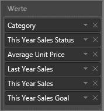
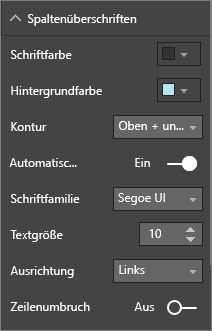
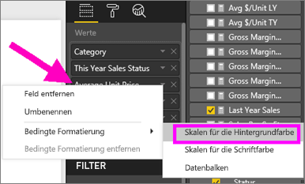
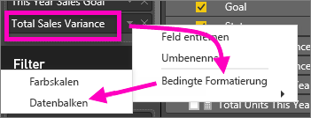

# Tabellen in Power BI-Berichten und -Dashboards
Eine Tabelle ist ein Raster, das zusammengehörende Daten in einer logischen Folge von Zeilen und Spalten enthält. Zudem können auch Kopfzeilen und eine Zeile für Summen enthalten sein. Tabellen empfehlen sich insbesondere für quantitative Vergleiche, bei denen Sie viele Werte einer einzigen Kategorie betrachten. In dieser Tabelle werden beispielsweise fünf verschiedene Measures für **Kategorie** angezeigt.

Erstellen Sie Tabellen in Berichten und heben Sie Elemente in der Tabelle mit anderen Visuals auf der gleichen Berichtsseite übergreifend hervor.  Darüber hinaus können Sie Zeilen, Spalten und sogar einzelne Zellen für die Kreuzhervorhebung auswählen. Die Auswahl einzelner und mehrerer Zellen kann kopiert und in andere Anwendungen eingefügt werden.

## Verwenden von Tabellen
Tabellen sind für folgende Zwecke gut geeignet:

* Anzeigen und Vergleichen detaillierter Daten und genauer Werte (anstelle von visuellen Darstellungen)
* Auflisten von Daten in einem Tabellenformat
* Anzeigen numerischer Daten nach Kategorien   

> [!NOTE]
> Enthält eine Tabelle zu viele Werte, erwägen Sie, sie in eine Matrix zu konvertieren und/oder die Drilldownfunktion zu verwenden. Es werden maximal 3.500 Datenpunkte angezeigt.

## Voraussetzungen
- Power BI-Dienst oder Power BI Desktop
- Retail Analysis sample

## Erstellen einer Tabelle
Wir erstellen die oben abgebildete Tabelle, in der Umsatzwerte nach Artikelkategorien angezeigt werden. Melden Sie sich beim Power BI-Dienst an, navigieren Sie zu **Daten abrufen\> Beispiele \> Analysebeispiel für Einzelhandel > Verbinden**, und klicken Sie auf **Zum Dashboard wechseln**. Zum Erstellen einer Visualisierung benötigen Sie Bearbeitungsberechtigungen für das Dataset und den Bericht. Erfreulicherweise können die Power BI-Beispiele alle bearbeitet werden. Wenn ein Bericht für Sie freigegeben wurde, können Sie keine Visualisierungen in Berichten erstellen.

1. Wählen Sie links im Navigationsbereich **Arbeitsbereiche > Mein Arbeitsbereich** aus.    
2. Wählen Sie die Registerkarte „Datasets“ aus, und führen Sie einen Bildlauf nach unten zum gerade hinzugefügten Dataset „Analysebeispiel für Einzelhandel“ durch.  Wählen Sie das Symbol **Bericht erstellen** aus.

    
2. Wählen Sie im Berichts-Editor **Element** > **Kategorie** aus.  Power BI erstellt automatisch eine Tabelle, in der alle Kategorien aufgelistet werden.

    
3. Wählen Sie **Sales > Average Unit Price** (Umsatz > Durchschnittlicher Stückpreis), **Sales > Last Year Sales** (Umsatz > Vorjahresumsatz) und **Sales > This Year Sales** (Umsatz > Diesjähriger Umsatz) aus, und wählen Sie alle drei Optionen („Wert“, „Ziel“, „Status“) aus.   
4. Suchen Sie im Visualisierungsbereich den Bereich **Werte**, und verschieben Sie die Werte mit Drag & Drop, bis die Reihenfolge der Diagrammspalten der in der ersten Abbildung auf dieser Seite entspricht.  Ihre Werte sehen nun wie folgt aus.

    
5. Heften Sie die Tabelle durch Auswählen des Anheften-Symbols am Dashboard an  

     

## Formatieren der Tabelle
Es gibt viele Möglichkeiten zum Formatieren einer Tabelle, hier werden nur einige davon behandelt. Wenn Sie andere Formatierungsoptionen kennenlernen möchten, können Sie den Formatierungsbereich öffnen (Farbrollensymbol und die einzelnen Optionen testen.

* Experimentieren Sie mit der Formatierung des Tabellenrasters. Hier haben wir ein blaues vertikales Raster hinzugefügt, Abstand zwischen den Zeilen hinzugefügt und die Kontur und den Text etwas vergrößert.

    

    
* Bei den Spaltenüberschriften wurde die Hintergrundfarbe geändert, eine Gliederung hinzugefügt und die Schriftgröße vergrößert. 

    

    

* Sie können sogar einzelne Spalten und Spaltenheader formatieren. Erweitern Sie dazu zunächst die **Feldformatierung**, und wählen Sie die zu formatierende Spalte aus der Dropdownliste aus. Je nach Spaltenwerten können Sie über die Feldformatierung u.a Folgendes festlegen: Anzeigeeinheiten, Anzahl der Dezimalstellen, Hintergrund und Ausrichtung. Wenn Sie die Einstellungen angepasst haben, können Sie diese auch auf die Header und die Ergebniszeile anwenden.

    

* Unten sehen Sie die fertige Tabelle nach einigen weiteren Formatierungen. Da es so viele Formatierungsoptionen gibt, lernen Sie am besten, indem Sie mit der Standardformatierung beginnen, den Formatierungsbereich  öffnen und die verschiedenen Optionen ausprobieren. 

    

### Bedingte Formatierung
Eine bestimmte Art der Formatierung wird als *bedingte Formatierung* bezeichnet und auf Felder in den Bereichen **Werte** und **Visualisierungen** im Power BI-Dienst oder in der Desktopversion angewendet. 

Mit der bedingten Formatierung für Tabellen können Sie benutzerdefinierte Hintergrundfarben für Zellen und Schriftfarben auf Grundlage von Zellwerten angeben, u.a. mit Verlaufsfarben. 

1. Wählen Sie im Bereich **Visualisierungen** im Power BI-Dienst oder in der Desktopversion den Dropdownpfeil neben dem Wert im Bereich **Werte** aus, den Sie formatieren möchten (oder klicken Sie mit der rechten Maustaste in das Feld). Sie können die bedingte Formatierung nur für Felder im Bereich **Werte** des Bereichs **Felder** verwalten.

    
2. Wählen Sie **Skalen für die Hintergrundfarbe** aus. Im angezeigten Dialogfeld können Sie die Farbe sowie die Werte für *Minimum* und *Maximum* konfigurieren. Wenn Sie das Kontrollkästchen **Abweichend** aktivieren, können Sie auch einen optionalen Wert für *Zentriert* konfigurieren.

    

    Lassen Sie uns jetzt einige benutzerdefinierte Formatierungen auf die Werte für den durchschnittlichen Einzelpreis anwenden. Wählen Sie **Abweichend** aus, fügen Sie Farben hinzu, und wählen Sie **OK** aus. 

    
3. Fügen Sie der Tabelle ein neues Feld mit positiven und negativen Werten hinzu.  Wählen Sie **Verkäufe > Gesamtabweichung Verkäufe** aus. 

    
4. Fügen Sie eine bedingte Formatierung für Datenbalken hinzu, indem Sie den Dropdownpfeil neben **Gesamtabweichung Verkäufe** und dann **Bedingte Formatierung > Datenbalken** auswählen.

    
5. Legen Sie im daraufhin angezeigten Dialogfeld Farben für **Positiver Balken** und **Negativer Balken** fest, aktivieren Sie **Nur Balken anzeigen**, und nehmen Sie ggf. weitere Änderungen vor.

    

    Wenn Sie **OK** auswählen, werden die numerischen Werte in der Tabelle durch Datenbalken ersetzt und sind so leichter zu erkennen.

    
6. Wenn Sie eine bedingte Formatierung aus einer Visualisierung entfernen möchten, klicken Sie einfach mit der rechten Maustaste erneut auf das Feld, und wählen Sie **Bedingte Formatierung entfernen** aus.

> [!TIP]
> Die bedingte Formatierung ist auch über den Formatierungsbereich verfügbar (Farbrollensymbol). Wählen Sie den zu formatierenden Wert aus, und legen Sie dann **Farbskalen** oder **Datenbalken** auf **Ein** fest, um die Standardeinstellungen zu übernehmen. Wenn Sie die Einstellungen anpassen möchten, wählen Sie **Erweiterte Steuerelemente** aus.
> 
## Kopieren von Werten aus Power BI-Tabellen zum Verwenden in anderen Anwendungen

Womöglich enthält Ihre Matrix oder Tabelle Inhalte, die Sie in anderen Anwendungen wie Dynamics CRM oder Excel oder sogar in anderen Power BI-Berichten verwenden möchten. Sie können in Power BI mit der rechten Maustaste auf eine einzelne Zelle oder eine Zellenauswahl klicken, um sie in die Zwischenablage zu kopieren und in die andere Anwendung einzufügen.

* Um den Wert einer einzelnen Zelle zu kopieren, wählen Sie die Zelle aus, klicken Sie mit der rechten Maustaste, und wählen Sie **Wert kopieren** aus. Der unformatierte Zellenwert befindet sich in der Zwischenablage und lässt sich nun in eine andere Anwendung einfügen.

    

* Um mehrere Zellen zu kopieren, markieren Sie einen Zellbereich, oder verwenden Sie die STRG-TASTE, um eine oder mehrere Zellen auszuwählen. Die Kopie enthält die Spalten- und Zeilenüberschriften.

    

    Die Kopie enthält die Spalten- und Zeilenüberschriften.

    

## Anpassen der Spaltenbreite in einer Tabelle
Gelegentlich wird in Power BI eine Spaltenüberschrift in einem Bericht oder in einem Dashboard abgeschnitten. Zeigen Sie zum Anzeigen des gesamten Spaltennamens mit dem Mauszeiger auf den Bereich rechts neben der Überschrift, um die Doppelpfeile einzublenden, wählen Sie sie aus, und ziehen Sie sie.

## Zu beachtende Aspekte und Problembehandlung
* Wenn Sie die Spaltenformatierung anwenden, können Sie nur eine Ausrichtungsoption pro Spalte auswählen: Auto, Links, Zentriert, Rechts. Normalerweise enthält eine Spalte den gesamten Text oder alle Zahlen und keine Mischung daraus. In Fällen, in denen jedoch eine Spalte jeweils Zahlen und Text enthält, wird durch die Auswahl von **Auto** der Text nach links ausgerichtet, und die Zahlen werden nach rechts ausgerichtet. Dieses Verhalten unterstützt Sprachen, bei denen von links nach rechts gelesen wird.   

## Nächste Schritte

[Treemaps in Power BI](power-bi-visualization-treemaps.md)

[Visualisierungstypen in Power BI](power-bi-visualization-types-for-reports-and-q-and-a.md)