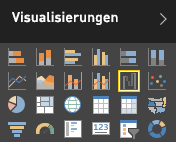
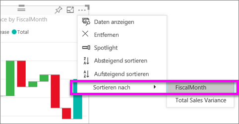
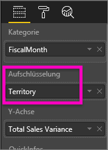
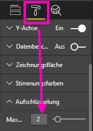

# Wasserfalldiagramme in Power BI

Wasserfalldiagramme zeigen eine laufende Summe an, während Power BI Werte hinzugefügt oder entfernt. Sie sind nützlich, um zu verdeutlichen, wie ein anfänglicher Wert (z.B. das Nettoeinkommen) durch eine Reihe von positiven und negativen Änderungen beeinflusst wird.

Die Säulen sind farbkodiert, damit Sie Zu- und Abnahmen der Werte schnell erkennen können. Die Säulen für den Anfangs- und den Endwert [gehen häufig von der horizontalen Achse aus](https://support.office.com/article/Create-a-waterfall-chart-in-Office-2016-for-Windows-8de1ece4-ff21-4d37-acd7-546f5527f185#BKMK_Float "gehen häufig von der horizontalen Achse aus"), während die Zwischenwerte unverankerte Säulen sind. Aufgrund dieses Aussehens werden Wasserfalldiagramme auch als „Brückendiagramme“ bezeichnet.

<iframe width="560" height="315" src="https://www.youtube.com/embed/qKRZPBnaUXM" frameborder="0" allow="autoplay; encrypted-media" allowfullscreen></iframe>

## Einsatz von Wasserfalldiagrammen

Wasserfalldiagramme sind gut für folgende Zwecke geeignet:

* Bei Änderungen der Zahlen im Laufe der Zeit, für eine Serie oder über verschiedene Kategorien hinweg.

* Zum Überwachen der wichtigsten Änderungen am Gesamtwert.

* Zum Anzeigen des jährlichen Gewinns Ihres Unternehmens mithilfe einer Darstellung verschiedener Umsatzquellen und letztendlich des Gesamtgewinns (oder -verlusts).

* Zum Illustrieren der Mitarbeiterzahl Ihres Unternehmens zu Jahresbeginn und -ende.

* Zum Visualisieren Ihrer Einnahmen und Ausgaben pro Monat und des laufenden Kontostands für Ihr Konto.

## Voraussetzungen

* Der Power BI-Dienst oder Power BI Desktop

* Bericht zum Analysebeispiel für den Einzelhandel

## Abrufen des Berichts zum Analysebeispiel für den Einzelhandel

In dieser Anleitung wird das Analysebeispiel für den Einzelhandel verwendet. Zum Erstellen einer Visualisierung benötigen Sie Bearbeitungsberechtigungen für das Dataset und den Bericht. Erfreulicherweise können die Power BI-Beispiele alle bearbeitet werden. Wenn jemand einen Bericht für Sie freigegeben hat, können Sie keine Visualisierungen in Berichten erstellen. Öffnen Sie zum besseren Verständnis den [Bericht zum Analysebeispiel für den Einzelhandel](../sample-datasets.md).

Nach dem Abrufen des Datasets für das **Analysebeispiel für den Einzelhandel** können Sie beginnen.

## Erstellen eines Wasserfalldiagramms

Sie erstellen ein Wasserfalldiagramm, mit dem Abweichungen beim Umsatz (geschätzter Umsatz im Vergleich zu tatsächlichen Verkaufszahlen) nach Monat dargestellt werden.

1. Wählen Sie in **Mein Arbeitsbereich** die Option **Datasets** > **Bericht erstellen** aus.

    

1. Wählen Sie im Bereich **Felder** die Option **Verkäufe** > **Gesamtabweichung Verkäufe** aus.

   

1. Wählen Sie das Wasserfallsymbol  aus, um das Diagramm in ein Treemap-Diagramm umzuwandeln.

    Wenn sich **Gesamtabweichung Verkäufe** nicht im Bereich der **Y-Achse** befindet, ziehen Sie es dorthin.

    

1. Wählen Sie **Zeit** > **FiscalMonth** aus, um den Wert dem Bereich **Kategorie** hinzuzufügen.

    

1. Stellen Sie sicher, dass Power BI das Wasserfalldiagramm chronologisch sortiert hat. Wählen Sie in der rechten oberen Ecke des Diagramms die Auslassungspunkte (...) aus.

    Überprüfen Sie, ob sich links von den Optionen **Aufsteigend sortieren** und **FiscalMonth** ein gelber Indikator befindet.

    

    Sie können auch die Werte auf der X-Achse betrachten und sehen dann, dass sie in der Reihenfolge von **Jan** bis **Aug** sortiert sind.

    Analysieren Sie die Informationen genauer, um zu ermitteln, was von Monat zu Monat am stärksten zu den Änderungen beiträgt.

1. Ziehen Sie **Store** > **Gebiet** in den Bucket **Aufschlüsselung**.

    

    Standardmäßig fügt Power BI die wichtigsten fünf Faktoren für die Steigerungen oder Verringerungen pro Monat hinzu.

    

    Sie interessieren sich aber nur für die ersten beiden Faktoren.

1. Wählen Sie im Bereich **Format** **Aufschlüsselung** aus, und legen Sie für **Max. Aufschlüsselungen** **2** fest.

    

    Ein kurzer Blick zeigt, dass die Gebiete „Ohio“ und „Pennsylvania“ im Wasserfalldiagramm den größten Anteil an positiven wie negativen Änderungen haben.

    

    Dies ist ein bemerkenswertes Ergebnis. Haben Ohio und Pennsylvania so starken Einfluss, weil der Umsatz in diesen beiden Gebieten sehr viel höher als in den anderen Gebieten ist? Das können Sie nachprüfen.

1. Erstellen Sie eine Karte, mit der der Umsatz dieses Jahres nach Umsatzwert und der des letzten Jahres nach Gebiet analysiert wird.

    

    Die Karte unterstützt unsere Theorie. Sie zeigt, dass diese beiden Gebiete im letzten Jahr (Blasengröße) und in diesem Jahr (Blasenschattierung) die höchsten Umsätze erzielt haben.

## Hervorheben und Kreuzfiltern

Informationen zur Verwendung des Bereichs **Filter** finden Sie unter [Hinzufügen eines Filters zu einem Bericht in der Bearbeitungsansicht](../power-bi-report-add-filter.md).

Das Markieren einer Säule in einem Wasserfalldiagramm ermöglicht ein Kreuzfiltern anderer Visualisierungen auf der Berichtsseite und umgekehrt. Die Säule mit dem **Gesamtwert** löst jedoch keine Markierung aus und reagiert nicht auf Kreuzfiltern.

## Nächste Schritte

* [Ändern der Interaktion von Visualisierungen in einem Power BI-Bericht](../service-reports-visual-interactions.md)

* [Visualisierungstypen in Power BI](power-bi-visualization-types-for-reports-and-q-and-a.md)
